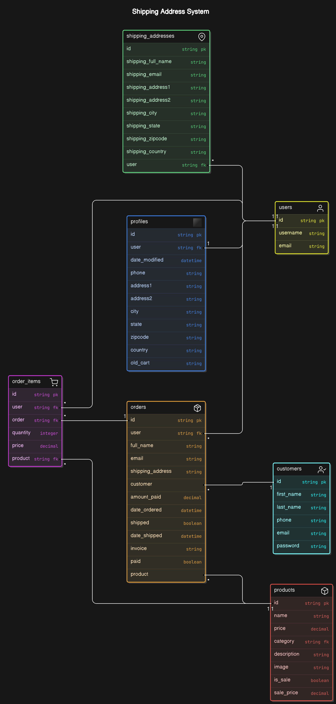
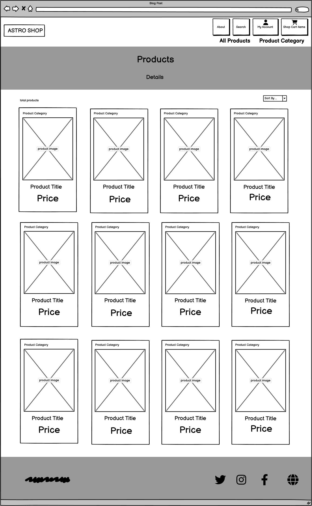
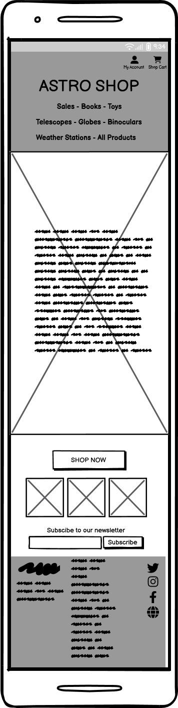
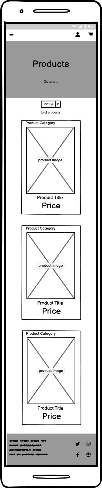

### Libraries and modules:

`asgiref==3.7.2`
ASGI (Asynchronous Server Gateway Interface) reference implementation. It provides utilities for building and maintaining asynchronous web applications in Python. This module is particularly useful for handling asynchronous protocols such as WebSockets and HTTP/2.

`boto3==1.35.45` is the AWS SDK for Python, enabling Python apps to manage and automate AWS resources like S3, EC2, and Lambda. It provides updated APIs for seamless integration with AWS services.

`botocore==1.35.45` is a core library for AWS SDK in Python, providing low-level access to AWS APIs. It underlies `boto3`, handling service requests, authentication, and responses for seamless AWS interactions.

`dj-database-url==0.5.0`
A utility for Django that allows database configuration from a URL string. This is particularly useful for deploying applications on platforms like Heroku, where database URLs are often provided in the environment variables.

`dj3-cloudinary-storage==0.0.6`
A storage backend for Django that integrates with Cloudinary. It allows developers to easily upload and manage media files in their Django applications using Cloudinary as the storage provider.

`django==4.2`
The latest version of the Django web framework, which is a high-level Python framework that encourages rapid development and clean, pragmatic design. Django is known for its scalability and its robust features like ORM, admin interface, authentication, and security features.

`django-paypal==2.1`
Is a Django app that integrates PayPal payment processing into Django projects. It supports both PayPal Payments Standard and PayPal Payments Pro, making it easy to add PayPal payment options to e-commerce sites built with Django.

`django-storages==1.14.4` 
Is a Django library providing integration with various cloud storage backends like Amazon S3, Google Cloud Storage, and Azure Storage. It simplifies managing static and media files in the cloud for Django applications, with customizable settings for each storage option.

`gunicorn==20.1.0`
A Python WSGI HTTP server for UNIX that serves web applications in a production environment. Gunicorn is lightweight and designed to handle many concurrent requests, making it a popular choice for deploying Django applications.

`jmespath==1.0.1` 
Is a Python library for JSON data querying. It enables searching, filtering, and extracting specific data from JSON documents using JMESPath syntax, which is useful for handling and manipulating JSON responses, especially in applications interacting with APIs.

`pillow==10.4.0` 
Is a Python Imaging Library (PIL) fork that adds image processing capabilities, including opening, manipulating, and saving many image formats like JPEG, PNG, and GIF. It’s commonly used in web development for tasks like resizing, cropping, and enhancing images.

`psycopg2==2.9.6` 
The most popular PostgreSQL database adapter for Python. Psycopg2 enables Python applications to connect to and interact with PostgreSQL databases, supporting advanced features like connection pooling and asynchronous operations.

`pycryptodome==3.21.0` 
Is a Python library offering cryptographic functions, including encryption, decryption, hashing, and digital signatures. It supports algorithms like AES, RSA, and SHA, making it useful for securing data in applications requiring cryptography.

`pytz==2024.2` 
Is a Python library providing accurate and up-to-date timezone definitions, essential for managing timezone conversions and handling daylight saving time changes in applications. It allows developers to work with timezone-aware `datetime` objects.

`s3transfer==0.10.3` 
Is a Python library that provides a high-level interface for transferring files to and from Amazon S3. It supports multipart uploads, automatic retries, and parallel transfers, enhancing the efficiency and reliability of file handling in applications that interact with S3.

`sqlparse==0.5.1` 
Is a non-validating SQL parser for Python. It provides tools for parsing, formatting, and analyzing SQL statements, making it useful for applications that require SQL code manipulation or analysis, such as ORM libraries or database administration tools.

`whitenoise==5.3.0`
A middleware for serving static files in a Django application. Whitenoise allows applications to serve static assets directly without needing a separate web server, simplifying deployment and reducing complexity.

| Scenario                                                        | Action                                                     | Result                                                                                    | Check |
| --------------------------------------------------------------- | ---------------------------------------------------------- | ----------------------------------------------------------------------------------------- | ----- |
| Click the “SHOP NOW” Button                                     | Should navigate to Products page                           | Redirect to “Product” page                                                                | PASS  |
| Fill in “Subscribe to our Newsletter”Fill in Email after Submit | Should navigate to Check Email Page                     | Redirect to “Check your Email” page                                                    | PASS  |
| Homepage – Header                                               |                                                            |                                                                                           |       |
| Click “Sales”                                                   | Should navigate to “Category/Sales”                        | Redirect to “category/Sales” page                                                         | PASS  |
| Click “Books”                                                   | Should navigate to “Category/Books”                        | Redirect to “category/books” page                                                         | PASS  |
| Clcik “Telescopes”                                              | Should navigate to “Category/Toys”                         | Redirect to “category/toys” page                                                          | PASS  |
| Clcik “Globes”                                                  | Should navigate to “Category/Globes”                       | Redirect to “category/globes” page                                                        | PASS  |
| Click “Binoculars”                                              | Should navigate to “Category/Binoculars”                   | Redirect to “category/binoculars” page                                                    | PASS  |
| Clcik “Weather Station”                                         | Should navigate to “Category/Weather Station”              | Redirect to “category/weather stations” page                                              | PASS  |
| Clcik “All Products”                                            | Should navigate to “Category/All Products”                 | Redirect to “category/all Products” page                                                  | PASS  |
| Click “My Account”                                              | Should navigate to Account Menu as Super User              | Show Menu                                                                                 |       |
| Click “My Account” – My Profile                                 | Should navigate to ‘Update User Profile”                   | Redirect to “Update User Profile” – page                                                  | Pass  |
| Click “My Account” – My Update Shipping                         | Should navigate to ‘Update Ship Profle”                    | Redirect to “Update Ship Profile” – page                                                  |       |
| Click “My Account” – My Payment                                 | Should navigate to ‘Update Payment Profle”                 | Redirect to “Update Payment Profile” – page                                               | PASS  |
| Click “My Account” – User Account                               | Should navigate to ‘User Account”                          | Redirect to “User Account” Settings                                                       | PASS  |
| Click “My Account” – Change Password                            | Should navigate to “Update Password”                       | Redirect to “Update Password” Page                                                        | PASS  |
| Click “My Account” – Log Out                                    | Should navigate to “Home Page”                             | Redirect to “Home Page” whit Message “You have logged out”                                |       |
| Click “My Account” – Add new product                            | Should navigate to “Add New Product”                       | Redirect to “Add a New Product”                                                           | PASS  |
| Click “My Account” – Supplier List                              | Should navigate to “Supplier List”                         | Redirect to “Suppliers” Page                                                              | PASS  |
| Click “My Account” – View Orders                                | Should navigate to “payment Orders ”                       | Redirect to “Payment Orders” Page                                                         | PASS  |
| Click ”My Account” – Shipped Orders                             | Should navigate to “Shipping Dashboard”                    | Redirect to “Shipped Dash” Page                                                           | PASS  |
| Click ”My Account” – Unshipped Orders                           | Should navigate to “Unshipping Dashboard”                  | Redirect to “Unshipped Dash” Page                                                         | PASS  |
| Click “My Account”                                              | Should navigate to Account Menu as Regular User            | Show Menu                                                                                 |       |
| Click “My Account” – My Profile                                 | Should navigate to ‘Update User Profile”                   | Redirect to “Update User Profile” – page                                                  | PASS  |
| Click “My Account” – My Update Shipping                         | Should navigate to ‘Update Ship Profle”                    | Redirect to “Update Ship Profile” – page                                                  | PASS  |
| Click “My Account” – My Payment                                 | Should navigate to ‘Update Payment Profle”                 | Redirect to “Update Payment Profile” – page                                               | PASS  |
| Click “My Account” – My Orders                                  | Should navigate to “payment Orders ”                       | Redirect to “Payment Orders” Page                                                         | PASS  |
| Click “My Account” – User Account                               | Should navigate to ‘User Account”                          | Redirect to “User Account” Settings                                                       | PASS  |
| Click “My Account” – Change Password                            | Should navigate to “Update Password”                       | Redirect to “Update Password” Page                                                        | PASS  |
| Click “My Account” – Log Out                                    | Should navigate to “Home Page”                             | Redirect to “Home Page” whit Message “You have logged out”                                | PASS  |
| Click “Shop Cart Items”                                         | Should navigate to “Shopping Cart”                         | Redirect to “ShopCart” Page                                                               | PASS  |
| Homepage – footer section                                       |                                                            |                                                                                           |       |
| Click “About”                                                   | Should navigate to “About”                                 | Redirect to “About” Page                                                                  | PASS  |
| Click “General Condintions”                                     | Should navigate to “General Conditions”                    | Redirect to “General Conditions ” Page                                                    | PASS  |
| Click “Privacy Policy”                                          | Should navigate to “Privacy Policy”                        | Redirect to “Privacy Policy” Page                                                         | PASS  |
| Click “Disclaimer”                                              | Should navigate to “Disclaimer”                            | Redirect to “Disclaimer” Page                                                             | PASS  |
| Click “Payment”                                                 | Should navigate to “Payment”                               | Redirect to “Payment” Page                                                                | PASS  |
| Homepage – socails section                                      |                                                            |                                                                                           |       |
| clcik “twitter”                                                 | Should navigate to “Twitter”                               | Redirect to “[https://x.com/?lang=en](https://x.com/?lang=en)” Page                       | PASS  |
| clcik “Instagram”                                               | Should navigate to “Instagram”                             | Redirect to “[https://www.instagram.com/](https://www.instagram.com/)” Page               | PASS  |
| clcik “facebook”                                                | Should navigate to “Facebook”                              | Redirect to “[https://www.facebook.com/](https://www.facebook.com/)” Page                 | PASS  |
| click “Globe”                                                   | Should navigate to “CodeInstitute”                         | Redirect to “[https://codeinstitute.net/global/](https://codeinstitute.net/global/)” Page | PASS  |
|                                                                 |                                                            |                                                                                           |       |
| Products Page – Template                                        |                                                            |                                                                                           |       |
| Click “Astro Shop” Button                                       | Should navigate to “Home Page”                             | Redirect to “Homepage”                                                                    | PASS  |
| Click “Product”                                                 | Should navigate to product                                 | Redirect to “product” page (product detail page)                                          | PASS  |
|                                                                 |                                                            |                                                                                           |       |
| Navbar Buttons                                                  |                                                            |                                                                                           |       |
| Click “About” Button                                            | Should navigate to “About”                                 | Redirect to “About” Page                                                                  | PASS  |
| Click “Search” Button                                           | Should navigate to “Search”                                | Redirect to “Search” Page                                                                 | PASS  |
| Click “My Account”                                              | Should navigate to Account Menu as Super User              | Show Menu                                                                                 | PASS  |
| Click “My Account” – My Profile                                 | Should navigate to ‘Update User Profile”                   | Redirect to “Update User Profile” – page                                                  | PASS  |
| Click “My Account” – My Update Shipping                         | Should navigate to ‘Update Ship Profle”                    | Redirect to “Update Ship Profile” – page                                                  | PASS  |
| Click “My Account” – My Payment                                 | Should navigate to ‘Update Payment Profle”                 | Redirect to “Update Payment Profile” – page                                               | PASS  |
| Click “My Account” – User Account                               | Should navigate to ‘User Account”                          | Redirect to “User Account” Settings                                                       | PASS  |
| Click “My Account” – Change Password                            | Should navigate to “Update Password”                       | Redirect to “Update Password” Page                                                        | PASS  |
| Click “My Account” – Log Out                                    | Should navigate to “Home Page”                             | Redirect to “Home Page” whit Message “You have logged out”                                | PASS  |
| Click “My Account” – Add new product                            | Should navigate to “Add New Product”                       | Redirect to “Add a New Product”                                                           | PASS  |
| Click “My Account” – Supplier List                              | Should navigate to “Supplier List”                         | Redirect to “Suppliers” Page                                                              | PASS  |
| Click “My Account” – View Orders                                | Should navigate to “payment Orders ”                       | Redirect to “Payment Orders” Page                                                         | PASS  |
| Click ”My Account” – Shipped Orders                             | Should navigate to “Shipping Dashboard”                    | Redirect to “Shipped Dash” Page                                                           | PASS  |
| Click ”My Account” – Unshipped Orders                           | Should navigate to “Unshipping Dashboard”                  | Redirect to “Unshipped Dash” Page                                                         | PASS  |
| Click “My Account”                                              | Should navigate to Account Menu as Regular User            | Show Menu                                                                                 | PASS  |
| Click “My Account” – My Profile                                 | Should navigate to ‘Update User Profile”                   | Redirect to “Update User Profile” – page                                                  | PASS  |
| Click “My Account” – My Update Shipping                         | Should navigate to ‘Update Ship Profle”                    | Redirect to “Update Ship Profile” – page                                                  | PASS  |
| Click “My Account” – My Payment                                 | Should navigate to ‘Update Payment Profle”                 | Redirect to “Update Payment Profile” – page                                               | PASS  |
| Click “My Account” – My Orders                                  | Should navigate to “payment Orders ”                       | Redirect to “Payment Orders” Page                                                         | PASS  |
| Click “My Account” – User Account                               | Should navigate to ‘User Account”                          | Redirect to “User Account” Settings                                                       | PASS  |
| Click “My Account” – Change Password                            | Should navigate to “Update Password”                       | Redirect to “Update Password” Page                                                        | PASS  |
| Click “My Account” – Log Out                                    | Should navigate to “Home Page”                             | Redirect to “Home Page” whit Message “You have logged out”                                | PASS  |
| Click “Shop Cart Items”                                         | Should navigate to “Shopping Cart”                         | Redirect to “ShopCart” Page                                                               | PASS  |
| Click All Products                                              | Should navigate to All Products Menu                       | Show Menu                                                                                 | PASS  |
| Click “By Price”                                                | Should navigate to Products page sort by price             | Redirect to Products page sort by price (ascending)                                       | PASS  |
| Click “By Category”                                             | Should navigate to Products page sort by category          | Redirect to Products page sort by category (category)                                     | PASS  |
| Click “All Products”                                            | Should navigate to Products page                           | Redirect to Products page                                                                 | PASS  |
| Click Product Category                                          | Should navigate to Product Category menu                   | Show Menu                                                                                 | PASS  |
| Click “Sale”                                                    | Should navigate to “Sale” category                         | Redirect to “Sale” page                                                                   | PASS  |
| Click “Books”                                                   | Should navigate to “Books” category                        | Redirect to “Books” page (product page by Books)                                          | PASS  |
| Click “Toys”                                                    | Should navigate to “Toys” category                         | Redirect to “Toys” page (product page by Toys)                                            | PASS  |
| Click “Telescopes”                                              | Should navigate to “Telescopes” category                   | Redirect to “Telescopes” page (product page by Telescopes)                                | PASS  |
| Click “Globes”                                                  | Should navigate to “Globes” category                       | Redirect to “Globes” page (product page by Globes)                                        | PASS  |
| Click “Specials”                                                | Should navigate to “Specials” category                     | Redirect to “Specials” page (product page by Specails)                                    | PASS  |
| Click “Weather Stations”                                        | Should navigate to “Weather Stations” category             | Redirect to “Weather Stations” page (product page by Weather Stations)                    | PASS  |
| Click “All Products”                                            | Should navigate to products                                | Redirect to “Products” page                                                               | PASS  |
|                                                                 |                                                            |                                                                                           |       |
| Click “Product”                                                 | Should navigate to product                                 | Redirect to “product” page (product detail page)                                          | PASS  |
|                                                                 |                                                            |                                                                                           |       |
| Product Details Page – logged in as regular user                |                                                            |                                                                                           |       |
| Navbar Buttons                                                  | see above – tests navbar – (regular user)                  | see above – tests navbar – (regular user)                                                 | PASS  |
| Click “Add to Chart” button                                     | Should navigate to “Product” + toast message succes        | Stay on the Product page                                                                  | PASS  |
| click “Category” item                                           | Should navigate to Category                                | Redirect to Products page sort by category (category)                                     | PASS  |
| Click “Quantity” selector                                       | Should select to quantity                                  | Set the amount of quantity                                                                | PASS  |
| Click “Delete Item” Button                                      | Should delete Item                                         | Toast Message “Item deleted from Shopping Cart”                                           | PASS  |
| Click “Edit Product”                                            | Should navigate to “Product update” page                   | Redirect to Products Update page                                                          | PASS  |
| Click “Back To Products”                                        | Should navigate to “Products” page                         | Redirect to Products page                                                                 | PASS  |
| Click “Checkout”                                                | Should navigate to “Check Out” page                        | Redirect to Check out page                                                                | PASS  |
|                                                                 |                                                            |                                                                                           |       |
| Shopcart Page (summary) – logged in as superuser                |                                                            |                                                                                           |       |
| Navbar Buttons                                                  | see above – tests navbar                                   | see above – tests navbar                                                                  | PASS  |
| Click “Add to Chart” button                                     | Should navigate to “Product” + toast message succes        | Stay on the Product page                                                                  | PASS  |
| click “Category” item                                           | Should navigate to Category                                | Redirect to Products page sort by category (category)                                     | PASS  |
| Click “Quantity” selector                                       | Should select to quantity                                  | Set the amount of quantity                                                                | PASS  |
| Click “Delete Product”                                          | Should navigate to “Delete Product Confirmation”           | Redirect to Delete Product Confirm page                                                   | PASS  |
| Click “Edit Product”                                            | Should navigate to “Product update” page                   | Redirect to Products Update page                                                          | PASS  |
| Click “Back To Products”                                        | Should navigate to “Products” page                         | Redirect to Products page                                                                 | PASS  |
| Click “Checkout”                                                | Should navigate to “Check Out” page                        | Redirect to Check out page                                                                | PASS  |
|                                                                 |                                                            |                                                                                           |       |
| Checkout Page                                                   |                                                            |                                                                                           |       |
| Navbar Buttons                                                  | see above – tests navbar                                   | see above – tests navbar                                                                  | PASS  |
| Click “Update Chart”                                            | Should navigate to “Shopcart” Page                         | Redirect to “ShopCart” Page                                                               | PASS  |
| Click “Make Order”                                              | Should navigate to “Billing Info” Page                     | Redirect to “Billing Info” Page                                                           | PASS  |
| Click “PayPal” Button                                           | Should navigate to “PayPal.com” Page                       | Redirect to “PayPal.com” Page                                                             | PASS  |
|                                                                 |                                                            |                                                                                           |       |
| Search Page                                                     |                                                            |                                                                                           |       |
| Navbar Buttons                                                  | see above – tests navbar                                   | see above – tests navbar                                                                  | PASS  |
| Click “Search”                                                  | Should navigate to “Search”Page (product found)            | Redirect to “Search” Page (listed products found)                                         | PASS  |
|                                                                 |                                                            |                                                                                           |       |
| Update User Profile – template                                  |                                                            |                                                                                           |       |
| Click “Back To Products”                                        | Should navigate to “Products” page                         | Redirect to “Products” page                                                               | PASS  |
| Click “Update Profile”                                          | Should navigate to “Products” page                         | Redirect to “Products” page                                                               | PASS  |
|                                                                 |                                                            |                                                                                           |       |
| Update Ship Profile – template                                  |                                                            |                                                                                           |       |
| Click “Back To Products”                                        | Should navigate to “Products” page                         | Redirect to “Products” page                                                               | PASS  |
| Click “Update Profile”                                          | Should navigate to “Products” page                         | Redirect to “Products” page                                                               | PASS  |
|                                                                 |                                                            |                                                                                           |       |
| Update User – template                                          |                                                            |                                                                                           |       |
| Click “Back To Products”                                        | Should navigate to “Products” page                         | Redirect to “Products” page                                                               | PASS  |
| Click “Update Profile”                                          | Should navigate to “Products” page                         | Redirect to “Products” page                                                               | PASS  |
|                                                                 |                                                            |                                                                                           |       |
| Update Password – template                                      |                                                            |                                                                                           |       |
| Click “Back To Products”                                        | Should navigate to “Products” page                         | Redirect to “Products” page                                                               | PASS  |
| Click “Update Password”                                         | Should navigate to “Products” page                         | Redirect to “Products” page                                                               | PASS  |
|                                                                 |                                                            |                                                                                           |       |
| Add New Product – template – as superuser                       |                                                            |                                                                                           |       |
| Click “Add Product”                                             | Should navigate to “Products” page                         | Redirect to “Products” page                                                               | PASS  |
| Click “Cancel”                                                  | Should navigate to “Products” page                         | Redirect to “Products” page                                                               | PASS  |
|                                                                 |                                                            |                                                                                           |       |
| Suppliers – template – as superuser                             |                                                            |                                                                                           |       |
| click “Add Supplier”                                            | Should navigate to “Supplier Add”page                      | Redirect to “Supllier Add” Page                                                           | PASS  |
| Click Nav link “Supplier”                                       | Should navigate to “Supplier” index page                   | Redirect to “Suppliers” index page                                                        | PASS  |
|                                                                 |                                                            |                                                                                           |       |
| View Orders – template – as superuser                           |                                                            |                                                                                           |       |
| Click “Mark as Shipped”                                         | Should navigate to “Mark Shipped”                          | Redirect to “Shipped” Page                                                                | PASS  |
| Click “Back To Products”                                        | Should navigate to “Products” page                         | Redirect to “Products” page                                                               | PASS  |
| Click “Shipped Orders”                                          | Should navigate to “Shipping Dashboard”                    | Redirect to “Shipped Dash” Page                                                           | PASS  |
| Click “Delete Order”                                            | Should navigate to “Delete Order”                          | Redirect to “Orders” Page                                                                 | PASS  |
|                                                                 |                                                            |                                                                                           |       |
| Shipped Items – template – as super user                        |                                                            |                                                                                           |       |
| Click nav link “Order”                                          | Should navigate to “Order” index page                      | Redirect to “Order” index page                                                            | PASS  |
| Click “Mark UnShipped”                                          | Should navigate to “Mark Unshipped”                        | Redirect to “Unshipped Dash” Page                                                         | PASS  |
| Click “Back To Products”                                        | Should navigate to “Products” page                         | Redirect to “Products” page                                                               | PASS  |
| Click “Unshipped Orders”                                        | Should navigate to “Unshipping Dashboard”                  | Redirect to “Unshipped Dash” Page                                                         | PASS  |
|                                                                 |                                                            |                                                                                           |       |
| UnShipped Items – template – as super user                      |                                                            |                                                                                           |       |
| Click nav link “Order”                                          | Should navigate to “Order” index page                      | Redirect to “Order” index page                                                            | PASS  |
| Click “Mark Shipped”                                            | Should navigate to “Mark Shipped”                          | Redirect to “Shipped” Page                                                                | PASS  |
| Click “Back To Products”                                        | Should navigate to “Products” page                         | Redirect to “Products” page                                                               | PASS  |
| Click “Shipped Orders”                                          | Should navigate to “Shipping Dashboard”                    | Redirect to “Shipped Dash” Page                                                           | PASS  |
|                                                                 |                                                            |                                                                                           |       |
| About – template                                                |                                                            |                                                                                           |       |
| Click “Back To Products”                                        | Should navigate to “Products” page                         | Redirect to “Products” page                                                               | PASS  |
|                                                                 |                                                            |                                                                                           |       |
| Disclaimer – template                                           |                                                            |                                                                                           |       |
| Click “Back To Products”                                        | Should navigate to “Products” page                         | Redirect to “Products” page                                                               | PASS  |
|                                                                 |                                                            |                                                                                           |       |
| General conditions – template                                   |                                                            |                                                                                           |       |
| Click “Back To Products”                                        | Should navigate to “Products” page                         | Redirect to “Products” page                                                               | PASS  |
|                                                                 |                                                            |                                                                                           |       |
| Privacy – template                                              |                                                            |                                                                                           |       |
| Click “Back To Products”                                        | Should navigate to “Products” page                         | Redirect to “Products” page                                                               | PASS  |
|                                                                 |                                                            |                                                                                           |       |
| Login – template                                                |                                                            |                                                                                           |       |
| Click “Login”                                                   | Should navigate to “Home” page                             | Redirect to “index” homepage                                                              | PASS  |
|                                                                 |                                                            |                                                                                           |       |
| Register – template                                             |                                                            |                                                                                           |       |
| Click “Register”                                                | Should navigate to “Update User And Shipping Profile” page | Redirect to “Update User And Shipping Profile” homepage                                   | PASS  |
|                                                                 |                                                            |                                                                                           |       |
| Update User And Shipping Profile – template                     |                                                            |                                                                                           |       |
| Click “Save Changes”                                            | Should navigate to “Products” page                         | Redirect to “Products” page                                                               | PASS  |

static/images/Desktop_Index.png

### Front Page Overview
The **Front Page** is designed to give a quick overview of a list of 5 blog posts ranked by the date added, with the most recent post at the top of the page.

1. **NavBar**: The 'navbar' has a dual function and can be used by both visitors and authenticated users.
   - **For Visitors & Users**: can quickly navigate back to the "homepage" by clicking the home icon or to the 'front page blog posts' by clicking the left arrow icon.
   - **For Visitors**: Visitors can always read posts but cannot participate. They have the option to view posts by category or to join Astro Share Blog by registering.
   - **For Users**: Users have full CRUD (Create, Read, Update, Delete) functionality for their own posts. The 'Add Post' option appears, and they see 'Logged in as,' giving them the ability to change their profile settings and details.

2. **Blog Post Snippets**: Each blog post is presented as a snippet along with a corresponding image.
   - **For Visitors**: The `[read more]` link redirects to the article detail page where the full post can be read.
   - **For Users**: Users have the same functionality as visitors, but on the redirected page, they have full control over their posts.

3. **Detailed Article Posts**: On this page, each post is treated individually.
   - **For Visitors**: Visitors can read the full blog post and any comments (if available). They cannot like or comment on posts. Visitors can click on the author's name to view the author’s profile page.
   - **For Users**: Users can read the post, comment, and 'Like' the posts. They can only 'Dislike' posts they have already liked.  
     The option to dislike posts outright is not part of the blog’s policy.

### Mobile first design
To ensure a seamless experience across devices, Bootstrap is used to make the Home- & Frontpage fully responsive. On mobile devices, the table features horizontal scrolling to prevent content compression, maintaining clarity and usability. Additionally, each table row highlights with a colour change on hover, making it easier for users to track their interactions as they navigate.

## Bootstrap themes

I choose to make life easier to use a (free) bootstap template from https://startbootstrap.com/template/shop-homepage
this theme i espiaclly designed for Ecommerce apllications.

It delivers the template file you can customize afterwords whit default ccs, js ,index page en asset folder for favicon.

It's recommend to use a front-end bootstrap template, so that easier to start the project and dive in to core application of Django.

## Colors

The color palette for this project has been carefully selected to ensure a professional and clean aesthetic, aligning with the brand identity and enhancing user experience. Below is a breakdown of the primary colors used across the application:

As for colors I decided to use Color-Hunt. https://colorhunt.co

- **Primary Color:** `#222831` -  is a dark charcoal gray with subtle blue-green undertones, perfect for sleek and modern designs.
- 

- **Secondary Color:** `#393E46` - (also atrribute color) s a dark plum or eggplant shade with a mix of deep purple and gray tones, ideal for rich and moody designs.
- 

- **Primary Color Highlight:** `#222831` - is a vibrant teal with cool blue and green tones, evoking a fresh, modern, and energetic feel.
- 

- **Background Color:** `#EEEEEE` - is a very light gray, almost white, offering a clean, soft, and neutral appearance.
- 

- **Accent Color:** `#00ADB5` - is a vibrant teal with cool blue and green tones, evoking a fresh, modern, and energetic feel.

- 

- **Main Text Color:** `#FFFFFF` - Tis pure white, the brightest and most neutral color, representing simplicity, cleanliness, and clarity.
- 
- **Secondary Text Color:** `#000000` - (--main-text-color-invers) Is pure black, the darkest color, symbolizing elegance, power, and sophistication.
- 

- **Highlight Hover Color:** `#FFC400` -  is a bold, vibrant yellow-gold, exuding warmth, energy, and a sense of luxury.
- 

- **Dark Text Shadow:** `2px 2px 4px rgba(0, 0, 0, 0.5)` - A bolder text shadow used on white backgrounds, ensuring 
that text stands out clearly.
- 

***

### Colors

As for colors I decided to use Color-Hunt. https://colorhunt.co

I will explain the uses of the various colors below, starting from top to bottom.

 

* #EEEEEE : This is the main background color.
* #686D76 : This is the border color.
* #373A40 : This is the accent color.
* #19D3DA : This is the seconary text color. (give a slide)
* #FFFFFF : This is the main text color.
* #000000 : This is the main text color.
* #FFD700 : (Gold) hover effect. index page
  

***

This color palette was chosen not only for its visual appeal but also for its contribution to a cohesive and user-friendly interface, reinforcing the professional and serious tone of the application.

### Color Customization Process

The colour customization process in this project was designed to offer flexibility and personalisation. I have implemented a series of **CSS Variables** to define various colour palettes.

Key elements of the colour customization process include:

- **Multiple Colour Palettes**: I have created several distinct colour palettes, each with its unique style—ranging from more traditional to modern and alternative designs. The default palette, known as the **root palette**, is the primary theme that all users see upon first visiting the site.

- **CSS Variables**: The different colour palettes are implemented using CSS Variables, which allows for dynamic and flexible styling of various elements across the site. This ensures a consistent and responsive design while providing a personalised experience for each user.

### Fonts

I used a combination of classic and modern fonts to diversify myself, I've integrated [Google Fonts](https://fonts.google.com/ "Google Fonts") to find a typeface that complements the website's aesthetic. For the main text, I've opted for [Montserrat](https://fonts.google.com/?query=+Montserrat "Montserrat") due to its classic appearance. Its make it easy to read long sentences.

### Icons

