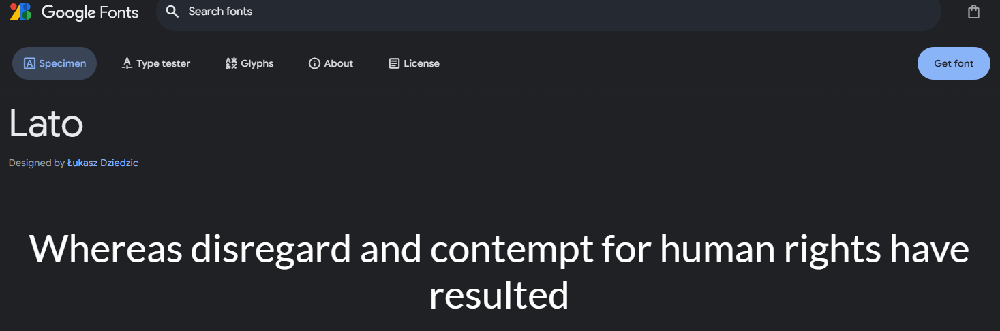
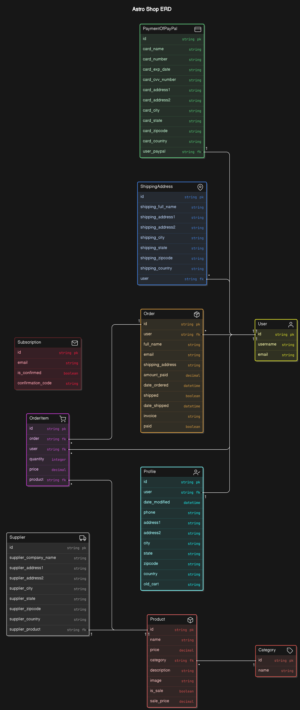
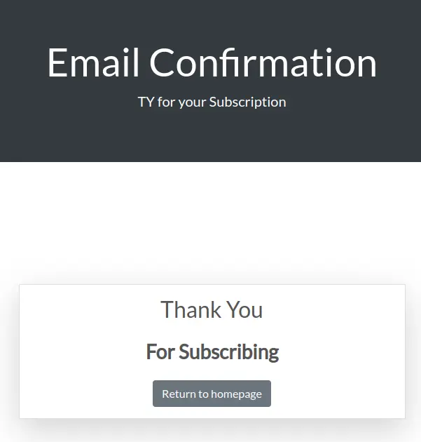
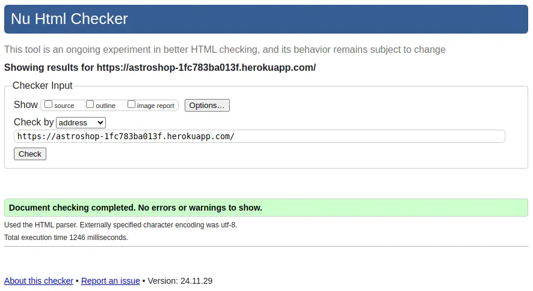
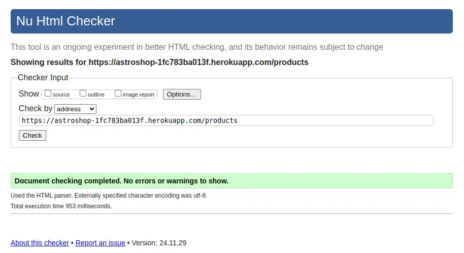
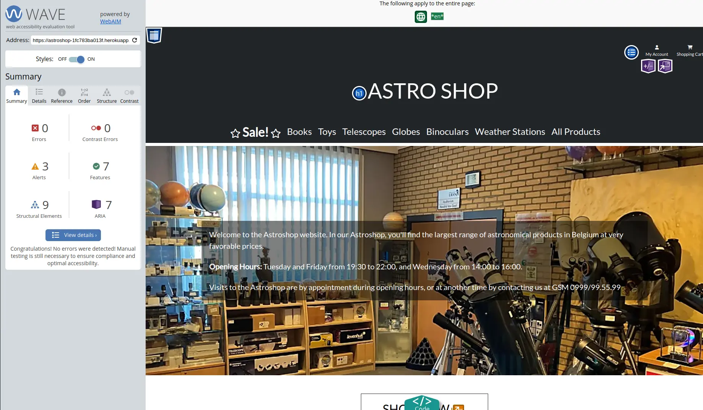
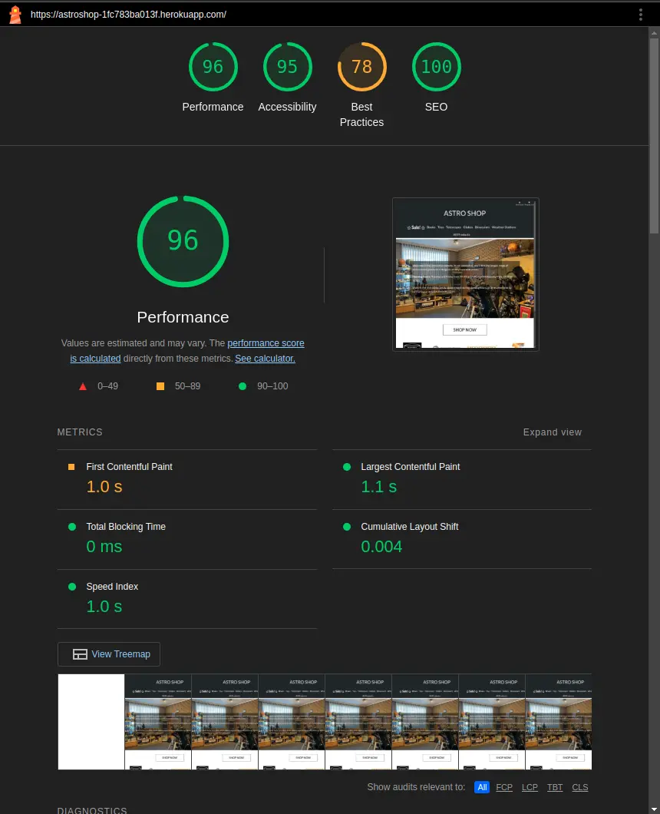

# Astro Shop

Explore the universe with AstroShop, the ultimate e-commerce destination for all your astronomical needs. From high-quality telescopes and astrophotography equipment to star charts and celestial decor, we have everything to fuel your passion for the stars. Whether you're an amateur stargazer or a seasoned astronomer, AstroShop brings the cosmos closer to home with premium products, expert advice, and a seamless shopping experience. 🌌✨

"Unlock the wonders of the universe—shop AstroShop today!"

A live version of the project can be accessed here: [AstroShop](https://https://astroshop-1fc783ba013f.herokuapp.com/)

# Table Of Contents
  - [Astro Shop](#astro-shop)
  - [Development Tools](#development-tools)
  - [CSS Management for Project Structure](#css-management-for-project-structure)
    - [Index Page Overview](#index-page-overview)
    - [Front Page Overview](#front-page-overview)
    - [Mobile first design](#mobile-first-design)
  - [Colors](#colors)
    - [Color Customization Process](#color-customization-process)  
  - [Fonts](#fonts)
  - [Icons](#icons)      
  - [Technologies Used](#technologies-used)
    - [Wireframes](#wireframes)
      - [Wireframes for Homepage & Frontpage](#wireframes-for-homepage--frontpage)
    - [Favicon](#favicon)
    - [Languages](#languages)
    - [Frameworks & Software](#frameworks--software)
    - [Libraries and modules](#libraries-and-modules)
    - [AWS](#aws)
    - [Newsletter Gmail API](#newsletter-gmail-api)    
    - [Bootstrap themes](#bootstrap-themes)
    - [The Structure Plane - Database](#the-structure-plane---database)
      - [Database](#database)
      - [Relationships](#relationships)
  - [Ecommerce](#e-commerce-business-model)
    - [Search Engine Optimization (SEO)](#search-engine-optimization-seo)
    - [Social Media Marketing](#social-media-marketing)
    - [Newsletter Marketing](#newsletter-marketing)
    - [Future Strategies to Support the E-Commerce Business Model](#future-strategies-to-support-the-e-commerce-business-model)
    - [Advanced SEO Techniques](#advanced-seo-techniques)
    - [Expand Social Media Marketing](#expanded-social-media-marketing)
    - [Email Marketing Enhancements](#email-marketing-enhancements)
  - [Testing](#testing)
    - [HTML Validation](#html-validation)
    - [CSS Validation](#css-validation)
    - [Accessibility](#accessibility)
    - [Wave Validation](#wave-validation) 
    - [Lighthouse Validation](#lighthouse-validation)
    - [JSHint Validation](#jshint-validation)
    - [Device Testing](#device-testing)
    - [Browser Compatibility](#browser-compatibility)
    - [PEP8](#pep8)
    - [Device Test](#device-testing)
    - [User Stories Testing](#user-story-testing)
  - [Deployment](#deployment)
    - [Heroku Deployment](#heroku-deployment)
    - [AWS](#aws)
    - [Local deployment](#local-deployment)
    - [Forking this GitHub repository](#forking-this-github-repository)
    - [Clone this repository](#clone-this-repository)
    - [Cloudinary](#cloudinary)
    - [Create PostgreSQL using Code Institute Database](#create-a-new-postgresql-code-institute-database)
    - [Gmail](#gmail)
  - [Bugs & Fixes](#bugs--fixes)
  - [License](#license)
  - [Credits](#credits)

## Development Tools

- **Bootstrap:** Bootstrap is a popular front-end development framework that helps developers create responsive, mobile-first websites quickly and efficiently. It provides a collection of pre-designed HTML, CSS, and JavaScript components like buttons, forms, navigation bars, and grid layouts. By using Bootstrap, developers can build modern, visually consistent web pages without writing extensive custom code. It's widely appreciated for its ease of use, customization options, and ability to adapt to various screen sizes, making it a go-to tool for fast web development.
- **Modular Design:** Modular design is a system design approach that divides a system into independent, interchangeable modules. Each module performs a specific function, enabling flexibility, easy maintenance, scalability, and reusability.
- **Consistent Aesthetic:** To maintaining a unified and cohesive visual style across all elements of a design. This includes consistent use of colors, fonts, shapes, and layout, ensuring that all components appear harmonious. It enhances user experience by creating familiarity and brand identity, making designs more professional and visually appealing.

[Table Of Contents](#table-of-contents)

## CSS Management for Project Structure

In my project, I decided to use a single CSS file, styles.css, to manage all the styling across the application.
These variables are defined within styles.css, and ensuring they work correctly is crucial for applying themes consistently across the site.

By consolidating all the styles into one file, I make managing themes straightforward. If I need to switch themes or make adjustments, I only need to modify this single CSS file, which allows for a seamless transition to a new look and feel across the entire application. This approach not only simplifies maintenance but also reinforces my focus on code reuse and consistency.

Additionally, having a single CSS file helps me avoid complications related to injecting styles through Bootstrap, ensuring that the CSS variables function as intended throughout the application.

### Index Page Overview

The homepage starts with a 'hero section' featuring an embedded video stream in replay, along with a parallax effect designed to captivate visitors. This section offers users the option to engage with the Blog Post.

Following this, the AstroBlog section provides a brief introduction to the purpose of the site, helping visitors quickly understand what the site is about.

To build more interest, I have incorporated an 'Astronomy Picture of the Day' (APOD) section where users and visitors always have a new astronomical item to explore, providing an easy and quick overview of the latest posts.

In a zigzag pattern, the most popular categories are displayed on the homepage. To encourage further engagement with the blog, a 'Latest Contributors' section is also included.

For astronomical enthusiasts, a nice widget is incorporated that tracks the current position of the International Space Station (ISS). When clicking on the 'Go To the ISS' button, a new page appears with an independently generated world map showing the ISS’s location.

At the bottom of the page, I have included a subscription section where users can join the mailing list to receive newsletters, information, and relevant benefits.

Finally, the page concludes with a footer that reinforces credibility and includes essential links, such as the social media links for the blog.

### Front Page Overview
The **Front Page** is designed to give a quick overview of a list of 5 blog posts ranked by the date added, with the most recent post at the top of the page.

1. **NavBar**: The 'navbar' has a dual function and can be used by both visitors and authenticated users.
   - **For Visitors & Users**: can quickly navigate back to the "homepage" by clicking the home icon or to the 'front page blog posts' by clicking the left arrow icon.
   - **For Visitors**: Visitors can always read posts but cannot participate. They have the option to view posts by category or to join Astro Share Blog by registering.
   - **For Users**: Users have full CRUD (Create, Read, Update, Delete) functionality for their own posts. The 'Add Post' option appears, and they see 'Logged in as,' giving them the ability to change their profile settings and details.

2. **Blog Post Snippets**: Each blog post is presented as a snippet along with a corresponding image.
   - **For Visitors**: The `[read more]` link redirects to the article detail page where the full post can be read.
   - **For Users**: Users have the same functionality as visitors, but on the redirected page, they have full control over their posts.

3. **Detailed Article Posts**: On this page, each post is treated individually.
   - **For Visitors**: Visitors can read the full blog post and any comments (if available). They cannot like or comment on posts. Visitors can click on the author's name to view the author’s profile page.
   - **For Users**: Users can read the post, comment, and 'Like' the posts. They can only 'Dislike' posts they have already liked.  
     The option to dislike posts outright is not part of the blog’s policy.

### Mobile first design
To ensure a seamless experience across devices, Bootstrap is used to make the Home- & Frontpage fully responsive. On mobile devices, the table features horizontal scrolling to prevent content compression, maintaining clarity and usability. Additionally, each table row highlights with a colour change on hover, making it easier for users to track their interactions as they navigate.

[Table Of Contents](#table-of-contents)

## Colors

The color palette for this project has been carefully selected to ensure a professional and clean aesthetic, aligning with the brand identity and enhancing user experience. Below is a breakdown of the primary colors used across the application:

As for colors I decided to use Color-Hunt. https://colorhunt.co

- **Primary Color:** `#222831` -  is a dark charcoal gray with subtle blue-green undertones, perfect for sleek and modern designs.
- 

- **Secondary Color:** `#393E46` - (also atrribute color) s a dark plum or eggplant shade with a mix of deep purple and gray tones, ideal for rich and moody designs.
- 

- **Primary Color Highlight:** `#222831` - is a vibrant teal with cool blue and green tones, evoking a fresh, modern, and energetic feel.
- 

- **Background Color:** `#EEEEEE` - is a very light gray, almost white, offering a clean, soft, and neutral appearance.
- 

- **Accent Color:** `#00ADB5` - is a vibrant teal with cool blue and green tones, evoking a fresh, modern, and energetic feel.

- 

- **Main Text Color:** `#FFFFFF` - Tis pure white, the brightest and most neutral color, representing simplicity, cleanliness, and clarity.
- 
- **Secondary Text Color:** `#000000` - (--main-text-color-invers) Is pure black, the darkest color, symbolizing elegance, power, and sophistication.
- 

- **Highlight Hover Color:** `#FFC400` -  is a bold, vibrant yellow-gold, exuding warmth, energy, and a sense of luxury.
- 

- **Dark Text Shadow:** `2px 2px 4px rgba(0, 0, 0, 0.5)` - A bolder text shadow used on white backgrounds, ensuring 
that text stands out clearly.
- 

### Color Customization Process

The colour customization process in this project was designed to offer flexibility and personalisation. I have implemented a series of **CSS Variables** to define various colour palettes.

Key elements of the colour customization process include:

- **Multiple Colour Palettes**: I have created several distinct colour palettes, each with its unique style—ranging from more traditional to modern and alternative designs. The default palette, known as the **root palette**, is the primary theme that all users see upon first visiting the site.

- **CSS Variables**: The different colour palettes are implemented using CSS Variables, which allows for dynamic and flexible styling of various elements across the site. This ensures a consistent and responsive design while providing a personalised experience for each user.

### Fonts - Typography

I used a combination of classic and modern fonts to diversify myself, I've integrated [Google Fonts](https://fonts.google.com/ "Google Fonts") to find a typeface that complements the website's aesthetic. For the main text, I've opted for [Lato](https://fonts.google.com/specimen/Lato?query=Lato/ "Lato") due to its classic appearance. Its make it easy to read long sentences.

To ensure accessibility and functionality across all devices and browsers, I included a fallback font stack. If Lato is unavailable, the design defaults to a generic sans-serif font, maintaining readability and visual appeal.

### Icons

As for icons and officious reason [Bootstrap Icons](https://getbootstrap.com/docs/5.0/extend/icons/ "Bootstrap Icons").

[Table Of Contents](#table-of-contents)

## Technologies Used

### Wireframes

The wireframes for this project served as a crucial guide during the development process, essentially acting as a blueprint for the design and layout of the website. My focus was primarily on two key pages: the index (or homepage) and the frontpage blog post. Given the repetitive nature of the blog post, I decided that it was a better idea to separate the homepage and the frontpage. The homepage serves more as an introductory page, while the frontpage blog post is a more active working page for the blog posts.

I chose to highlight only two wireframes in this README as they are the most critical to the overall user experience. Other pages did not require such detailed wireframing and followed more standard, basic templates.

### Wireframes for Homepage & Frontpage

  
Wireframe for Homepage (index) - Desktop 

  

 

  
Wireframe for Product Page - Desktop

  

 

  
Wireframe for Tablet Homepage Responsive

  

 

  
Wireframe for Tablet Products Responsive
  
  

 

  
Wireframe for Smart Phone Homepage Responsive

  

 

  
Wireframe for Smart Phone Products Responsive
  
  

 

### Favicon

The favicon was created with [Favicon.io](https://favicon.io/favicon-generator/). 

  

### Languages
* [Python](https://en.wikipedia.org/wiki/Python_(programming_language)) - Provides the functionality for the site.
* [HTML5](https://en.wikipedia.org/wiki/HTML) - Provides the content and structure for the website.
* [CSS3](https://en.wikipedia.org/wiki/CSS) - Provides the styling for the website.
* [JavaScript](https://en.wikipedia.org/wiki/JavaScript) - Provides interactive elements of the website

### Frameworks & Software
* [Gitpod](http://gitpod.io) - Cloud based IDE
* [Bootstrap](https://getbootstrap.com/) - A CSS framework that helps building solid, responsive, mobile-first sites
  -  **Bootstrap:** Integrated to utilize its responsive grid system and pre-built components, ensuring the site is mobile-friendly and adaptable to different screen sizes.
* [Django](https://www.djangoproject.com/) - A model-view-template framework used to create the Review | Alliance site
* [Balsamiq](https://balsamiq.com/) - Used to create the wireframe.
* [Pexels](https://www.pexels.com/) - Used for background image and animation video.
* [Github](https://github.com/) - Used to host and edit the website.
* [Eraser](https://app.eraser.io/) - Used to created the Database layout schema.
* [Heroku](https://en.wikipedia.org/wiki/Heroku) - A cloud platform that the application is deployed to.
* [Lighthouse](https://developer.chrome.com/docs/lighthouse/overview/) - Used to test performance of site.
* [Responsive Design Checker](https://www.responsivedesignchecker.com/) - Used for responsiveness check.
* [Wave Web Accessibility Evaluation Tool](https://wave.webaim.org/) - Used to validate the sites accessibility.
* [Favicon](https://favicon.io/) - Used to create the favicon.
* [Google Chrome DevTools](https://developer.chrome.com/docs/devtools/) - Used to debug and test responsiveness.
* [ChatGPT](http://chatgpt.com) AI tool for troubleshooting and repetitive tasks.
* [HTML Validation](https://validator.w3.org/) - Used to validate HTML code
  -  **HTML:** The foundation for structuring the web pages, providing the semantic markup needed for the site's content.
* [CSS Validation](https://jigsaw.w3.org/css-validator/) - Used to validate CSS code
  -  **PostgreSQL:** The primary database used to store user data, blog post listings, article details, ... chosen for its flexibility and scalability.
* [PEP8 Validation](https://pep8ci.herokuapp.com/#) - Used to validate code 
* [JSHint Validation](https://jshint.com/) - Used to validate JavaScript code
  -  **JavaScript:** Employed to add interactivity and dynamic elements to the site, enhancing the user experience with features like form validation and asynchronous content updates.

[Table Of Contents](#table-of-contents)

 ### Libraries, Modules & Packages

  
Libraries and modules

    

`asgiref==3.8.1`
ASGI (Asynchronous Server Gateway Interface) reference implementation. It provides utilities for building and maintaining asynchronous web applications in Python. This module is particularly useful for handling asynchronous protocols such as WebSockets and HTTP/2.

`boto3==1.35.45` is the AWS SDK for Python, enabling Python apps to manage and automate AWS resources like S3, EC2, and Lambda. It provides updated APIs for seamless integration with AWS services.

`botocore==1.35.45` is a core library for AWS SDK in Python, providing low-level access to AWS APIs. It underlies `boto3`, handling service requests, authentication, and responses for seamless AWS interactions.

`cart==1.2.2` A cart module in Django is used to manage shopping cart functionality in e-commerce applications. It typically involves:

Models: To store cart items (e.g., Cart and CartItem models).
Views: To handle adding, updating, and removing items from the cart.
Templates: To display the cart to users, showing item details, quantities, and totals.
Sessions: Often used to track the cart for anonymous users.
Utilities: For calculating totals, taxes, and discounts.
The cart module integrates seamlessly with other modules like orders and payments for a complete checkout process.

`chardet==5.2.0` is a Python package used for detecting the character encoding of text. It's commonly used in web scraping, file parsing, and other situations where text encoding needs to be determined dynamically.

`cloudinary==5.2.0` is a cloud-based service that provides tools for managing, optimizing, and delivering media (images, videos, and other assets) for websites and applications. It is commonly used in Django and other web frameworks to handle media storage and delivery efficiently.

`dj-database-url==0.5.0`
A utility for Django that allows database configuration from a URL string. This is particularly useful for deploying applications on platforms like Heroku, where database URLs are often provided in the environment variables.

`django==4.2`
The latest version of the Django web framework, which is a high-level Python framework that encourages rapid development and clean, pragmatic design. Django is known for its scalability and its robust features like ORM, admin interface, authentication, and security features.

`django-paypal==2.1`
Is a Django app that integrates PayPal payment processing into Django projects. It supports both PayPal Payments Standard and PayPal Payments Pro, making it easy to add PayPal payment options to e-commerce sites built with Django.

`django-storages==1.14.4` 
Is a Django library providing integration with various cloud storage backends like Amazon S3, Google Cloud Storage, and Azure Storage. It simplifies managing static and media files in the cloud for Django applications, with customizable settings for each storage option.

`gunicorn==20.1.0`
A Python WSGI HTTP server for UNIX that serves web applications in a production environment. Gunicorn is lightweight and designed to handle many concurrent requests, making it a popular choice for deploying Django applications.

`jmespath==1.0.1` 
Is a Python library for JSON data querying. It enables searching, filtering, and extracting specific data from JSON documents using JMESPath syntax, which is useful for handling and manipulating JSON responses, especially in applications interacting with APIs.

`pillow==10.4.0` 
Is a Python Imaging Library (PIL) fork that adds image processing capabilities, including opening, manipulating, and saving many image formats like JPEG, PNG, and GIF. It’s commonly used in web development for tasks like resizing, cropping, and enhancing images.

`psycopg2==2.9.6` 
The most popular PostgreSQL database adapter for Python. Psycopg2 enables Python applications to connect to and interact with PostgreSQL databases, supporting advanced features like connection pooling and asynchronous operations.

`pycryptodome==3.21.0` 
Is a Python library offering cryptographic functions, including encryption, decryption, hashing, and digital signatures. It supports algorithms like AES, RSA, and SHA, making it useful for securing data in applications requiring cryptography.

`pytz==2024.2` 
Is a Python library providing accurate and up-to-date timezone definitions, essential for managing timezone conversions and handling daylight saving time changes in applications. It allows developers to work with timezone-aware `datetime` objects.

`s3transfer==0.10.3` 
Is a Python library that provides a high-level interface for transferring files to and from Amazon S3. It supports multipart uploads, automatic retries, and parallel transfers, enhancing the efficiency and reliability of file handling in applications that interact with S3.

`setuptools==75.3.0`
is a widely used Python library for building, packaging, and distributing Python projects. It provides tools to define a project’s metadata, dependencies, and installation instructions. It is often used alongside pip and is essential for creating Python packages.

`sqlparse==0.5.1` 
Is a non-validating SQL parser for Python. It provides tools for parsing, formatting, and analyzing SQL statements, making it useful for applications that require SQL code manipulation or analysis, such as ORM libraries or database administration tools.

`whitenoise==5.3.0`
A middleware for serving static files in a Django application. Whitenoise allows applications to serve static assets directly without needing a separate web server, simplifying deployment and reducing complexity.
  

[Table Of Contents](#table-of-contents)

## AWS

In this project, I use **AWS S3 Object Storage** services to store product images directly in AWS.  
You can create a free account for development purposes to integrate it into your project.

**AWS S3** (Amazon Simple Storage Service) is a scalable, secure, and high-performance cloud storage solution provided by Amazon Web Services. It is designed for object storage, allowing users to store and retrieve data of any size and type, such as images, videos, documents, or backups. 

### Key Features

- **Scalability**: Automatically scales to handle increasing or decreasing storage needs.  
- **Durability and Availability**: Offers 99.9% durability and high availability across multiple geographic regions.  
- **Cost-Effective**: Flexible pricing with options like S3 Standard for frequently accessed data, S3 Glacier for archival storage, and S3 Intelligent-Tiering for automated cost optimization.  
- **Security**: Provides encryption, access control, and compliance features to protect data.  
- **Integration**: Works seamlessly with other AWS services and supports APIs for custom integrations.  

S3 is widely used for website hosting, data backups, content delivery, and big data analytics.

### How to Set It Up?

The setup can be quite comprehensive, so [here](https://docs.google.com/document/d/1bqvCFiCW_JV9sllNZrN5uUJpIiusHICTk4TIk3oUWHY/edit?tab=t.0#heading=h.jypp4mbtvx4q)
 is a guide to help you through it.

## Newsletter Gmail API

A newsletter subscription integration for example Facebook marketing allows businesses to reach their audience directly through Facebook's platform. By leveraging the newsletter, developers can create seamless subscription options, enabling users to sign up for newsletters while engaging with your brand on Facebook. This integration can streamline the process of collecting subscriber information, automating newsletter delivery, and managing subscriber data.

With the newsletter subscription API, the business can target their audience more effectively, ensuring newsletters are personalized and relevant to users' interests. Additionally, this integration helps track engagement metrics and optimize marketing efforts for better outreach and conversions.

- More information how to integrate the Gmail API can be found [here](https://developers.google.com/gmail/api/guides)

[Table Of Contents](#table-of-contents)

## Bootstrap themes

I choose to make life easier to use a free bootstap template from https://startbootstrap.com/template/shop-homepage
this theme i espiaclly designed for Ecommerce apllications.

It delivers the template file you can customize afterwords whit default ccs, js ,index page en asset folder for favicon.

It's recommend to use a front-end bootstrap template, so that easier to start the project and dive in to core application of Django.

### The Structure Plane - Database

The database schema was created with [eraser](https://app.eraser.io/workspace/A4EDloZQMT27ohXOp7Vj)

  
ERD - Diagram

  

### Database 

I used a PostgreSQL provided by Code Institute as relational database.

- **FieldTypes:** 
  - AutoField: An integer field that automatically increments.
  - CharField: A text field with a maximum length.
  - EmailField: A CharField that checks if the value is a valid email address.
  - DateTimeField: A field for storing date and time.
  - DateField: A field for storing dates.
  - TextField: A large text field.
  - OneToOneField: A one-to-one relationship.
  - ForeignKey: A many-to-one relationship.
  - IntegerField: An integer field.
  - DecimalField: A fixed-precision decimal number.
  - URLField: A CharField for URLs.
  - ResizedImageField: An image field with resizing options. 

### Relationships

The **Astro Shop ERD** describes the relationships between various entities in an e-commerce application. Here's an overview:

**User and PaymentOfPayPal**:
  - Each user can have multiple PayPal payment methods, represented in the `PaymentOfPayPal` table. The `user_paypal` field in  `PaymentOfPayPal` links to the id `id` of the `User` table (one-to-many relationship).

**User and ShippingAddress**
  - Each user can have multiple shipping addresses. The `user` field in the `ShippingAddress` table refers to the `id` of the `User` table (one-to-many relationship).

**User and Order**
  - Each order is associated with a specific user. The `user` field in the `Order` table links to the `id` of the `User` table (one-to-many relationship).

**Order and OrderItem**
  - Each order can contain multiple items. The `order` field in `OrderItem` refers to the `id` of the `Order` table (one-to-many relationship).

**Product and OrderItem**
  - Each order item represents a specific product. The `product` field in `OrderItem` connects to the id `id` of the `Product` table (many-to-one relationship).

**User and OrderItem**
  - Each order item also tracks the user who purchased it. The user `git clone`field in `OrderItem` links to the `id` of the `User` table (many-to-one relationship).

**User and Profile**
  - Each user can have one profile. The `user` field in the `Profile` table refers to the `id` of the `User` table (one-to-one relationship).

**Category and Product**
  - Each product belongs to one category `category`. The category `category` field in the `Product` table links to the `id` of the `Category` table (many-to-one relationship).

**Supplier and Product**
  - Each supplier provides one specific product. The `supplier_product` field in the `Supplier` table refers to the `id` of the `Product` table (one-to-one relationship).

**Subscription**
  - Subscriptions track email addresses for newsletters or updates. No direct relationships with other tables are indicated in the diagram.

In summary, the Astro Shop ERD showcases how users, orders, products, categories, suppliers, and related entities interact within the system, with well-defined relationships to manage payments, profiles, and shipping.

**note:** The **Subscriber Model** has only one particlular function and that is to make a list for all user who to join the newsletter, they don't have to be active member of the astro shop website and is oly used for marketing purposes.

[Table Of Contents](#table-of-contents)

## E-Commerce Business Model

This application incorporates several key strategies to ensure a sustainable and successful e-commerce business. Below are the primary components that underline the model:

### Search Engine Optimization (SEO)

Effective SEO techniques have been integrated to improve the visibility and reach of the website. Key features include:

- Meta tags: Meta descriptions and keywords are dynamically added within Django templates to improve search engine rankings, using carefully researched long and short-form keywords identified through brainstorming, Google tools, and keyword analysis.
- Sitemap: A sitemap file is provided, allowing search engines to efficiently crawl and index the site's structure.
- Robots.txt: A robots.txt file has been included to guide search engines on which parts of the site to crawl and index, optimizing the crawl budget.

Other optimizations include:

- Alt text for images: All product images include descriptive alt text, making the site more accessible and improving image search rankings.
- Mobile responsiveness: The site's design is fully responsive, catering to a growing audience of mobile users, which search engines favour.
- Optimized URLs: The application uses clean and descriptive URLs, which are user-friendly and beneficial for SEO.

### Social Media Marketing

To support the website, a Facebook Business Page has been created. This serves as an additional platform for brand visibility and user engagement.

- Why businesses use Facebook pages: Social media platforms, especially Facebook, allow businesses to connect directly with their audience, foster community, and share updates about products or promotions.
- Value to the company: A Facebook page increases the company’s reach, drives traffic to the website, and creates a space for user-generated content, such as reviews and testimonials, which can further boost credibility.
 

  
Click to view Facebook Mockup Fan Page

  Facebook Mockup 
  

### Newsletter Marketing

The website features a newsletter signup option in the footer, enabling users to subscribe by sharing their email addresses. 

This approach offers several advantages:

- User retention: Regular newsletters keep the brand in the minds of customers, encouraging repeat visits and purchases.
- Targeted marketing: Collecting user data allows for more personalized and segmented marketing campaigns, increasing conversion rates.
- Announcements and promotions: Newsletters provide a direct channel for communicating new product launches, sales events, and exclusive discounts to loyal customers.

By combining these strategies, the e-commerce application creates a strong foundation for attracting, engaging, and retaining customers while maintaining scalability for future growth.

### Future Strategies to Support the E-Commerce Business Model

To further enhance the e-commerce business model and drive growth, the following strategies could be implemented in the future:

### Advanced SEO Techniques

- Structured Data Markup: Adding schema.org markup to product pages to improve how information appears in search results, including rich snippets for reviews, prices, and availability.
- Voice Search Optimization: Tailoring content to accommodate the growing trend of voice search, using natural language and question-based keywords.
- Faster Page Load Times: Optimizing images, implementing lazy loading, and using Content Delivery Networks (CDNs) to enhance page speed, which is critical for SEO and user experience.

### Expanded Social Media Marketing

- Multi-platform Presence: Establishing a presence on platforms like Instagram and Pinterest, which are highly visual and align well with the luxury perfume market.
- Influencer Partnerships: Collaborating with influencers to promote products, increase brand credibility, and reach niche audiences.
- Social Commerce: Integrating product catalogs directly into social media platforms for seamless shopping experiences.

### Email Marketing Enhancements

- Drip Campaigns: Creating automated email sequences to nurture leads, onboard new customers, and re-engage inactive users.
- Personalization: Using customer data to send tailored recommendations, offers, and content to improve engagement and conversions.
- Analytics Integration: Using email marketing analytics to measure the success of campaigns and refine strategies over time.

[Table Of Contents](#table-of-contents)

## Testing

### HTML Validation

All pages have been passed through the [W3C HTML Validator](https://validator.w3.org/) successfully save for a few minor issues which have been left 'as is' as attempts to correct them proved unsuccessful and lead to results which devalued the user experience. Specifically, these were:

I ensured that the HTML structure of AstroBlog adheres strictly to web standards. I utilized the W3C Validator to validate our HTML code, striving to minimize and eliminate all possible errors. There are many templates to consider but the main pages where is the focus of stite are the Homepage and the Frontpaga-Blogpost.
After experimenting whit different container layout and fixing all the issues validation results showed **zero errors**.

The detail of these test can evaluate on this link.

  
Click to view HTML Validation Results

  homepage
  
   

  products
  

### CSS Validation

    

The CSS of AstroBlog has been carefully crafted and validated to ensure it adheres to the highest standards. I utilized the W3C CSS Validator to check for any errors, and I'm pleased to report that our stylesheets passed with **zero errors**.

This thorough validation process ensures that the user interface is both visually appealing and fully compliant with modern web standards. We took particular care to validate our responsive design elements to ensure consistency across all devices.

Here’s the validation result:

  
Click to view CSS Validation Result

  

 

[Table Of Contents](#table-of-contents)

### Accessibility

Ensuring accessibility is a key priority for AstroBlog. We've taken great care to make sure our platform is inclusive and usable by as many people as possible, regardless of their abilities or the devices they are using.

Throughout the development process, we adhered to the Web Content Accessibility Guidelines (WCAG) to guarantee that our site meets accessibility standards. This includes:

- **Proper use of ARIA attributes:** We have utilized ARIA attributes effectively to enhance the accessibility of dynamic content and interactive elements, ensuring screen readers can accurately convey the information to users.
- **Keyboard Navigation:** All interactive elements, including forms, buttons, and navigation links, are fully accessible via keyboard navigation, making the site usable without a mouse.
- **Contrast Ratios:** We carefully selected our color scheme to ensure sufficient contrast between text and background colors, making the content readable for users with visual impairments.
- **Alt Text for Images:** All images include descriptive `alt` attributes, providing context to users who rely on screen readers.

These efforts help ensure that our site is not only compliant with accessibility standards but also provides an inclusive user experience. We continue to monitor and improve the accessibility of astroblog as we develop new features and enhancements.

[Table Of Contents](#table-of-contents)

### Wave Validation

I have conducted a thorough accessibility audit using the WAVE (Web Accessibility Evaluation Tool). There is a smooth transition between the header of the page and the rest of the main page. Nevertheless, there are some issues to address due to the background MPEG replay. WAVE is dynamic and cannot make a persistent measurement of background contrast.

   
  
Click to view Wave Homepage Result

  
   

 

I have also identified contrast issues with the modal buttons, which follow a similar color pattern to the Flash Danger alerts. However, the inclusion of shadow effects and other design enhancements significantly aids visibility. I believe these design choices ensure the buttons remain accessible and visually clear, even if they do not fully meet WAVE’s contrast recommendations.

   
  
Click to view Contrast Errors homepage footer

  
   

 

Overall, the WAVE validation confirms that our website adheres to accessibility standards, with only a few minor contrast issues that have been carefully considered in the design process. While I will continue exploring potential solutions to these issues, I have prioritized maintaining a visually cohesive and intuitive theme for the site.

### Lighthouse Validation

My Lighthouse validation results have been very promising, with high scores across most categories. One area where I noticed a slightly lower score is in SEO, and I’m actively working on improvements to achieve even better results. Lighthouse has been instrumental in helping me organize my files and optimize for performance.

   
  
Click to view Lighthouse Homepage Result

  
   

 

   
  
Click to view Lighthouse mobile Result

  
   

 
A specific recommendation from Lighthouse was to use the WebP format for images to improve load times. In response, I made sure that all images served through the browser are now in WebP format. However, I also understand that too much compression could negatively impact the user experience, especially on larger screens. So, I made a conscious decision to balance performance with visual quality. After gathering feedback from a diverse group of users, I confirmed that the image quality is well-received across various devices. As a result, I decided to maintain slightly larger image sizes to prioritize a smooth and visually appealing experience, even if it means sacrificing a little bit of performance.

Additionally, Lighthouse suggested reducing the CSS payload, which I’m currently considering. One option I’m exploring is breaking the main styles.css file into smaller files tied to specific widgets. This would allow me to send only the necessary CSS for each page, potentially cutting down the overall size of the CSS file and improving load times.

While the desktop version scores are very high, the mobile version, although still passing, has some room for improvement. I’m committed to refining these areas to ensure the best possible experience across all devices.

### JSHint Validation

Although my project doesn't include an extensive amount of JavaScript, I can ensured that the code we do have is fully validated using [**JSHint**](https://jshint.com/). I'm pleased to report that my JavaScript code has passed the validation process with a 99% clean bill of health—no errors whatsoever.

There is only one warning that issue has probably to do JSHint interpreter itself.

   
  
Click to view JSHint Result

  

### PEP8
All Python files as well *env.py* and *manage.py*, have been passed through the [Code Institute PEP8 Linter](https://pep8ci.herokuapp.com/).

   
  
Click to view PEP8 Result

  PEP8 Compliant

  | Directory | File        | Check |
  | --------- | ----------- | ----- |
  | shopper   | Settings.py | PASS  |
  | shopper   | urls.py     | PASS  |
  | shopper   | env.py      | PASS  |
  | shopper   | manage.py   | PASS  |
  | payment   | admin.py    | PASS  |
  | payment   | apps.py     | PASS  |
  | payment   | forms.py    | PASS  |
  | payment   | models.py   | PASS  |
  | payment   | urls.py     | PASS  |
  | payment   | views.py    | PASS  |
  | shopcart  | admin.py    | PASS  |
  | shopcart  | apps.py     | PASS  |
  | shopcart  | cart.py     | PASS  |
  | shopcart  | context_processors.py    | PASS  |
  | shopcart  | models.py   | PASS  |
  | shopcart  | urls.py     | PASS  |
  | shopcart  | views.py    | PASS  |
  | store     | admin.py    | PASS  |
  | store     | apps.py     | PASS  |
  | store     | forms.py    | PASS  |
  | store     | models.py   | PASS  |
  | store     | urls.py     | PASS  |
  | store     | views.py    | PASS  |

   

### Device Testing

The website has undergone thorough testing across a variety of devices, including desktop computers, tablets, and smartphones. We focused on ensuring that the responsiveness of the site is consistent and effective across all screen sizes, providing an optimal user experience regardless of the device used.

To achieve this, we employed media queries to adapt the layout for different screen sizes. This approach ensures that when the device's dimensions fall within specific ranges, certain elements will reposition themselves, maintaining readability and proper alignment. 

For instance, on smaller screens, such as smartphones, we adjusted the distribution of content to ensure that all elements are easily accessible and clearly visible, avoiding any overlap or readability issues. The result is a fluid and intuitive experience across devices, meeting our goal of a responsive design that performs well on all tested platforms.

## User Story Testing

Manual Testing Result Report

 

| Scenario                                                        | Action                                                     | Result                                                                                    | Check |
| --------------------------------------------------------------- | ---------------------------------------------------------- | ----------------------------------------------------------------------------------------- | ----- |
| Click the “SHOP NOW” Button                                     | Should navigate to Products page                           | Redirect to “Product” page                                                                | PASS  |
| Fill in “Subscribe to our Newsletter”Fill in Email after Submit | Should navigate to Check Email Page                     | Redirect to “Check your Email” page                                                    | PASS  |
| Homepage – Header                                               |                                                            |                                                                                           |       |
| Click “Sales”                                                   | Should navigate to “Category/Sales”                        | Redirect to “category/Sales” page                                                         | PASS  |
| Click “Books”                                                   | Should navigate to “Category/Books”                        | Redirect to “category/books” page                                                         | PASS  |
| Clcik “Telescopes”                                              | Should navigate to “Category/Toys”                         | Redirect to “category/toys” page                                                          | PASS  |
| Clcik “Globes”                                                  | Should navigate to “Category/Globes”                       | Redirect to “category/globes” page                                                        | PASS  |
| Click “Binoculars”                                              | Should navigate to “Category/Binoculars”                   | Redirect to “category/binoculars” page                                                    | PASS  |
| Clcik “Weather Station”                                         | Should navigate to “Category/Weather Station”              | Redirect to “category/weather stations” page                                              | PASS  |
| Clcik “All Products”                                            | Should navigate to “Category/All Products”                 | Redirect to “category/all Products” page                                                  | PASS  |
| Click “My Account”                                              | Should navigate to Account Menu as Super User              | Show Menu                                                                                 |       |
| Click “My Account” – My Profile                                 | Should navigate to ‘Update User Profile”                   | Redirect to “Update User Profile” – page                                                  | Pass  |
| Click “My Account” – My Update Shipping                         | Should navigate to ‘Update Ship Profle”                    | Redirect to “Update Ship Profile” – page                                                  |       |
| Click “My Account” – My Payment                                 | Should navigate to ‘Update Payment Profle”                 | Redirect to “Update Payment Profile” – page                                               | PASS  |
| Click “My Account” – User Account                               | Should navigate to ‘User Account”                          | Redirect to “User Account” Settings                                                       | PASS  |
| Click “My Account” – Change Password                            | Should navigate to “Update Password”                       | Redirect to “Update Password” Page                                                        | PASS  |
| Click “My Account” – Log Out                                    | Should navigate to “Home Page”                             | Redirect to “Home Page” whit Message “You have logged out”                                |       |
| Click “My Account” – Add new product                            | Should navigate to “Add New Product”                       | Redirect to “Add a New Product”                                                           | PASS  |
| Click “My Account” – Supplier List                              | Should navigate to “Supplier List”                         | Redirect to “Suppliers” Page                                                              | PASS  |
| Click “My Account” – View Orders                                | Should navigate to “payment Orders ”                       | Redirect to “Payment Orders” Page                                                         | PASS  |
| Click ”My Account” – Shipped Orders                             | Should navigate to “Shipping Dashboard”                    | Redirect to “Shipped Dash” Page                                                           | PASS  |
| Click ”My Account” – Unshipped Orders                           | Should navigate to “Unshipping Dashboard”                  | Redirect to “Unshipped Dash” Page                                                         | PASS  |
| Click “My Account”                                              | Should navigate to Account Menu as Regular User            | Show Menu                                                                                 |       |
| Click “My Account” – My Profile                                 | Should navigate to ‘Update User Profile”                   | Redirect to “Update User Profile” – page                                                  | PASS  |
| Click “My Account” – My Update Shipping                         | Should navigate to ‘Update Ship Profle”                    | Redirect to “Update Ship Profile” – page                                                  | PASS  |
| Click “My Account” – My Payment                                 | Should navigate to ‘Update Payment Profle”                 | Redirect to “Update Payment Profile” – page                                               | PASS  |
| Click “My Account” – My Orders                                  | Should navigate to “payment Orders ”                       | Redirect to “Payment Orders” Page                                                         | PASS  |
| Click “My Account” – User Account                               | Should navigate to ‘User Account”                          | Redirect to “User Account” Settings                                                       | PASS  |
| Click “My Account” – Change Password                            | Should navigate to “Update Password”                       | Redirect to “Update Password” Page                                                        | PASS  |
| Click “My Account” – Log Out                                    | Should navigate to “Home Page”                             | Redirect to “Home Page” whit Message “You have logged out”                                | PASS  |
| Click “Shop Cart Items”                                         | Should navigate to “Shopping Cart”                         | Redirect to “ShopCart” Page                                                               | PASS  |
| Homepage – footer section                                       |                                                            |                                                                                           |       |
| Click “About”                                                   | Should navigate to “About”                                 | Redirect to “About” Page                                                                  | PASS  |
| Click “General Condintions”                                     | Should navigate to “General Conditions”                    | Redirect to “General Conditions ” Page                                                    | PASS  |
| Click “Privacy Policy”                                          | Should navigate to “Privacy Policy”                        | Redirect to “Privacy Policy” Page                                                         | PASS  |
| Click “Disclaimer”                                              | Should navigate to “Disclaimer”                            | Redirect to “Disclaimer” Page                                                             | PASS  |
| Click “Payment”                                                 | Should navigate to “Payment”                               | Redirect to “Payment” Page                                                                | PASS  |
| Homepage – socails section                                      |                                                            |                                                                                           |       |
| clcik “twitter”                                                 | Should navigate to “Twitter”                               | Redirect to “[https://x.com/?lang=en](https://x.com/?lang=en)” Page                       | PASS  |
| clcik “Instagram”                                               | Should navigate to “Instagram”                             | Redirect to “[https://www.instagram.com/](https://www.instagram.com/)” Page               | PASS  |
| clcik “facebook”                                                | Should navigate to “Facebook”                              | Redirect to “[https://www.facebook.com/](https://www.facebook.com/)” Page                 | PASS  |
| click “Globe”                                                   | Should navigate to “CodeInstitute”                         | Redirect to “[https://codeinstitute.net/global/](https://codeinstitute.net/global/)” Page | PASS  |
|                                                                 |                                                            |                                                                                           |       |
| Products Page – Template                                        |                                                            |                                                                                           |       |
| Click “Astro Shop” Button                                       | Should navigate to “Home Page”                             | Redirect to “Homepage”                                                                    | PASS  |
| Click “Product”                                                 | Should navigate to product                                 | Redirect to “product” page (product detail page)                                          | PASS  |
|                                                                 |                                                            |                                                                                           |       |
| Navbar Buttons                                                  |                                                            |                                                                                           |       |
| Click “About” Button                                            | Should navigate to “About”                                 | Redirect to “About” Page                                                                  | PASS  |
| Click “Search” Button                                           | Should navigate to “Search”                                | Redirect to “Search” Page                                                                 | PASS  |
| Click “My Account”                                              | Should navigate to Account Menu as Super User              | Show Menu                                                                                 | PASS  |
| Click “My Account” – My Profile                                 | Should navigate to ‘Update User Profile”                   | Redirect to “Update User Profile” – page                                                  | PASS  |
| Click “My Account” – My Update Shipping                         | Should navigate to ‘Update Ship Profle”                    | Redirect to “Update Ship Profile” – page                                                  | PASS  |
| Click “My Account” – My Payment                                 | Should navigate to ‘Update Payment Profle”                 | Redirect to “Update Payment Profile” – page                                               | PASS  |
| Click “My Account” – User Account                               | Should navigate to ‘User Account”                          | Redirect to “User Account” Settings                                                       | PASS  |
| Click “My Account” – Change Password                            | Should navigate to “Update Password”                       | Redirect to “Update Password” Page                                                        | PASS  |
| Click “My Account” – Log Out                                    | Should navigate to “Home Page”                             | Redirect to “Home Page” whit Message “You have logged out”                                | PASS  |
| Click “My Account” – Add new product                            | Should navigate to “Add New Product”                       | Redirect to “Add a New Product”                                                           | PASS  |
| Click “My Account” – Supplier List                              | Should navigate to “Supplier List”                         | Redirect to “Suppliers” Page                                                              | PASS  |
| Click “My Account” – View Orders                                | Should navigate to “payment Orders ”                       | Redirect to “Payment Orders” Page                                                         | PASS  |
| Click ”My Account” – Shipped Orders                             | Should navigate to “Shipping Dashboard”                    | Redirect to “Shipped Dash” Page                                                           | PASS  |
| Click ”My Account” – Unshipped Orders                           | Should navigate to “Unshipping Dashboard”                  | Redirect to “Unshipped Dash” Page                                                         | PASS  |
| Click “My Account”                                              | Should navigate to Account Menu as Regular User            | Show Menu                                                                                 | PASS  |
| Click “My Account” – My Profile                                 | Should navigate to ‘Update User Profile”                   | Redirect to “Update User Profile” – page                                                  | PASS  |
| Click “My Account” – My Update Shipping                         | Should navigate to ‘Update Ship Profle”                    | Redirect to “Update Ship Profile” – page                                                  | PASS  |
| Click “My Account” – My Payment                                 | Should navigate to ‘Update Payment Profle”                 | Redirect to “Update Payment Profile” – page                                               | PASS  |
| Click “My Account” – My Orders                                  | Should navigate to “payment Orders ”                       | Redirect to “Payment Orders” Page                                                         | PASS  |
| Click “My Account” – User Account                               | Should navigate to ‘User Account”                          | Redirect to “User Account” Settings                                                       | PASS  |
| Click “My Account” – Change Password                            | Should navigate to “Update Password”                       | Redirect to “Update Password” Page                                                        | PASS  |
| Click “My Account” – Log Out                                    | Should navigate to “Home Page”                             | Redirect to “Home Page” whit Message “You have logged out”                                | PASS  |
| Click “Shop Cart Items”                                         | Should navigate to “Shopping Cart”                         | Redirect to “ShopCart” Page                                                               | PASS  |
| Click All Products                                              | Should navigate to All Products Menu                       | Show Menu                                                                                 | PASS  |
| Click “By Price”                                                | Should navigate to Products page sort by price             | Redirect to Products page sort by price (ascending)                                       | PASS  |
| Click “By Category”                                             | Should navigate to Products page sort by category          | Redirect to Products page sort by category (category)                                     | PASS  |
| Click “All Products”                                            | Should navigate to Products page                           | Redirect to Products page                                                                 | PASS  |
| Click Product Category                                          | Should navigate to Product Category menu                   | Show Menu                                                                                 | PASS  |
| Click “Sale”                                                    | Should navigate to “Sale” category                         | Redirect to “Sale” page                                                                   | PASS  |
| Click “Books”                                                   | Should navigate to “Books” category                        | Redirect to “Books” page (product page by Books)                                          | PASS  |
| Click “Toys”                                                    | Should navigate to “Toys” category                         | Redirect to “Toys” page (product page by Toys)                                            | PASS  |
| Click “Telescopes”                                              | Should navigate to “Telescopes” category                   | Redirect to “Telescopes” page (product page by Telescopes)                                | PASS  |
| Click “Globes”                                                  | Should navigate to “Globes” category                       | Redirect to “Globes” page (product page by Globes)                                        | PASS  |
| Click “Specials”                                                | Should navigate to “Specials” category                     | Redirect to “Specials” page (product page by Specails)                                    | PASS  |
| Click “Weather Stations”                                        | Should navigate to “Weather Stations” category             | Redirect to “Weather Stations” page (product page by Weather Stations)                    | PASS  |
| Click “All Products”                                            | Should navigate to products                                | Redirect to “Products” page                                                               | PASS  |
|                                                                 |                                                            |                                                                                           |       |
| Click “Product”                                                 | Should navigate to product                                 | Redirect to “product” page (product detail page)                                          | PASS  |
|                                                                 |                                                            |                                                                                           |       |
| Product Details Page – logged in as regular user                |                                                            |                                                                                           |       |
| Navbar Buttons                                                  | see above – tests navbar – (regular user)                  | see above – tests navbar – (regular user)                                                 | PASS  |
| Click “Add to Chart” button                                     | Should navigate to “Product” + toast message succes        | Stay on the Product page                                                                  | PASS  |
| click “Category” item                                           | Should navigate to Category                                | Redirect to Products page sort by category (category)                                     | PASS  |
| Click “Quantity” selector                                       | Should select to quantity                                  | Set the amount of quantity                                                                | PASS  |
| Click “Delete Item” Button                                      | Should delete Item                                         | Toast Message “Item deleted from Shopping Cart”                                           | PASS  |
| Click “Edit Product”                                            | Should navigate to “Product update” page                   | Redirect to Products Update page                                                          | PASS  |
| Click “Back To Products”                                        | Should navigate to “Products” page                         | Redirect to Products page                                                                 | PASS  |
| Click “Checkout”                                                | Should navigate to “Check Out” page                        | Redirect to Check out page                                                                | PASS  |
|                                                                 |                                                            |                                                                                           |       |
| Shopcart Page (summary) – logged in as superuser                |                                                            |                                                                                           |       |
| Navbar Buttons                                                  | see above – tests navbar                                   | see above – tests navbar                                                                  | PASS  |
| Click “Add to Chart” button                                     | Should navigate to “Product” + toast message succes        | Stay on the Product page                                                                  | PASS  |
| click “Category” item                                           | Should navigate to Category                                | Redirect to Products page sort by category (category)                                     | PASS  |
| Click “Quantity” selector                                       | Should select to quantity                                  | Set the amount of quantity                                                                | PASS  |
| Click “Delete Product”                                          | Should navigate to “Delete Product Confirmation”           | Redirect to Delete Product Confirm page                                                   | PASS  |
| Click “Edit Product”                                            | Should navigate to “Product update” page                   | Redirect to Products Update page                                                          | PASS  |
| Click “Back To Products”                                        | Should navigate to “Products” page                         | Redirect to Products page                                                                 | PASS  |
| Click “Checkout”                                                | Should navigate to “Check Out” page                        | Redirect to Check out page                                                                | PASS  |
|                                                                 |                                                            |                                                                                           |       |
| Checkout Page                                                   |                                                            |                                                                                           |       |
| Navbar Buttons                                                  | see above – tests navbar                                   | see above – tests navbar                                                                  | PASS  |
| Click “Update Chart”                                            | Should navigate to “Shopcart” Page                         | Redirect to “ShopCart” Page                                                               | PASS  |
| Click “Make Order”                                              | Should navigate to “Billing Info” Page                     | Redirect to “Billing Info” Page                                                           | PASS  |
| Click “PayPal” Button                                           | Should navigate to “PayPal.com” Page                       | Redirect to “PayPal.com” Page                                                             | PASS  |
|                                                                 |                                                            |                                                                                           |       |
| Search Page                                                     |                                                            |                                                                                           |       |
| Navbar Buttons                                                  | see above – tests navbar                                   | see above – tests navbar                                                                  | PASS  |
| Click “Search”                                                  | Should navigate to “Search”Page (product found)            | Redirect to “Search” Page (listed products found)                                         | PASS  |
|                                                                 |                                                            |                                                                                           |       |
| Update User Profile – template                                  |                                                            |                                                                                           |       |
| Click “Back To Products”                                        | Should navigate to “Products” page                         | Redirect to “Products” page                                                               | PASS  |
| Click “Update Profile”                                          | Should navigate to “Products” page                         | Redirect to “Products” page                                                               | PASS  |
|                                                                 |                                                            |                                                                                           |       |
| Update Ship Profile – template                                  |                                                            |                                                                                           |       |
| Click “Back To Products”                                        | Should navigate to “Products” page                         | Redirect to “Products” page                                                               | PASS  |
| Click “Update Profile”                                          | Should navigate to “Products” page                         | Redirect to “Products” page                                                               | PASS  |
|                                                                 |                                                            |                                                                                           |       |
| Update User – template                                          |                                                            |                                                                                           |       |
| Click “Back To Products”                                        | Should navigate to “Products” page                         | Redirect to “Products” page                                                               | PASS  |
| Click “Update Profile”                                          | Should navigate to “Products” page                         | Redirect to “Products” page                                                               | PASS  |
|                                                                 |                                                            |                                                                                           |       |
| Update Password – template                                      |                                                            |                                                                                           |       |
| Click “Back To Products”                                        | Should navigate to “Products” page                         | Redirect to “Products” page                                                               | PASS  |
| Click “Update Password”                                         | Should navigate to “Products” page                         | Redirect to “Products” page                                                               | PASS  |
|                                                                 |                                                            |                                                                                           |       |
| Add New Product – template – as superuser                       |                                                            |                                                                                           |       |
| Click “Add Product”                                             | Should navigate to “Products” page                         | Redirect to “Products” page                                                               | PASS  |
| Click “Cancel”                                                  | Should navigate to “Products” page                         | Redirect to “Products” page                                                               | PASS  |
|                                                                 |                                                            |                                                                                           |       |
| Suppliers – template – as superuser                             |                                                            |                                                                                           |       |
| click “Add Supplier”                                            | Should navigate to “Supplier Add”page                      | Redirect to “Supllier Add” Page                                                           | PASS  |
| Click Nav link “Supplier”                                       | Should navigate to “Supplier” index page                   | Redirect to “Suppliers” index page                                                        | PASS  |
|                                                                 |                                                            |                                                                                           |       |
| View Orders – template – as superuser                           |                                                            |                                                                                           |       |
| Click “Mark as Shipped”                                         | Should navigate to “Mark Shipped”                          | Redirect to “Shipped” Page                                                                | PASS  |
| Click “Back To Products”                                        | Should navigate to “Products” page                         | Redirect to “Products” page                                                               | PASS  |
| Click “Shipped Orders”                                          | Should navigate to “Shipping Dashboard”                    | Redirect to “Shipped Dash” Page                                                           | PASS  |
| Click “Delete Order”                                            | Should navigate to “Delete Order”                          | Redirect to “Orders” Page                                                                 | PASS  |
|                                                                 |                                                            |                                                                                           |       |
| Shipped Items – template – as super user                        |                                                            |                                                                                           |       |
| Click nav link “Order”                                          | Should navigate to “Order” index page                      | Redirect to “Order” index page                                                            | PASS  |
| Click “Mark UnShipped”                                          | Should navigate to “Mark Unshipped”                        | Redirect to “Unshipped Dash” Page                                                         | PASS  |
| Click “Back To Products”                                        | Should navigate to “Products” page                         | Redirect to “Products” page                                                               | PASS  |
| Click “Unshipped Orders”                                        | Should navigate to “Unshipping Dashboard”                  | Redirect to “Unshipped Dash” Page                                                         | PASS  |
|                                                                 |                                                            |                                                                                           |       |
| UnShipped Items – template – as super user                      |                                                            |                                                                                           |       |
| Click nav link “Order”                                          | Should navigate to “Order” index page                      | Redirect to “Order” index page                                                            | PASS  |
| Click “Mark Shipped”                                            | Should navigate to “Mark Shipped”                          | Redirect to “Shipped” Page                                                                | PASS  |
| Click “Back To Products”                                        | Should navigate to “Products” page                         | Redirect to “Products” page                                                               | PASS  |
| Click “Shipped Orders”                                          | Should navigate to “Shipping Dashboard”                    | Redirect to “Shipped Dash” Page                                                           | PASS  |
|                                                                 |                                                            |                                                                                           |       |
| About – template                                                |                                                            |                                                                                           |       |
| Click “Back To Products”                                        | Should navigate to “Products” page                         | Redirect to “Products” page                                                               | PASS  |
|                                                                 |                                                            |                                                                                           |       |
| Disclaimer – template                                           |                                                            |                                                                                           |       |
| Click “Back To Products”                                        | Should navigate to “Products” page                         | Redirect to “Products” page                                                               | PASS  |
|                                                                 |                                                            |                                                                                           |       |
| General conditions – template                                   |                                                            |                                                                                           |       |
| Click “Back To Products”                                        | Should navigate to “Products” page                         | Redirect to “Products” page                                                               | PASS  |
|                                                                 |                                                            |                                                                                           |       |
| Privacy – template                                              |                                                            |                                                                                           |       |
| Click “Back To Products”                                        | Should navigate to “Products” page                         | Redirect to “Products” page                                                               | PASS  |
|                                                                 |                                                            |                                                                                           |       |
| Login – template                                                |                                                            |                                                                                           |       |
| Click “Login”                                                   | Should navigate to “Home” page                             | Redirect to “index” homepage                                                              | PASS  |
|                                                                 |                                                            |                                                                                           |       |
| Register – template                                             |                                                            |                                                                                           |       |
| Click “Register”                                                | Should navigate to “Update User And Shipping Profile” page | Redirect to “Update User And Shipping Profile” homepage                                   | PASS  |
|                                                                 |                                                            |                                                                                           |       |
| Update User And Shipping Profile – template                     |                                                            |                                                                                           |       |
| Click “Save Changes”                                            | Should navigate to “Products” page                         | Redirect to “Products” page                                                               | PASS  |

 

[Table Of Contents](#table-of-contents)

### Browser Compatibility

I have conducted extensive testing to ensure that the website is fully compatible across a range of web browsers. Specifically, the site has been tested on:

-  **Google Chrome**
-  **Microsoft Edge**
-  **Opera**
-  **Mozilla Firefox**

 

   
  
Click to view Google Browser Result

  
   

 

   
  
Click to view Edge Browser Result

  
   

 

   
  
Click to view FireFox Browser Result

  
   

 

   
  
Click to view Opera Browser Result

  
   

 

In each browser, the website performs smoothly, maintaining consistent functionality and appearance. We focused on ensuring that all features, from user registration to job application processes, operate seamlessly regardless of the browser used.

No significant issues were encountered during the tests, confirming that our site is accessible and reliable across these popular browsers. This ensures that users can interact with the platform without any unexpected disruptions, regardless of their preferred browser.

## Deployment

### Heroku Deployment
This site was deployed to and is currently [hosted on the Heroku platform](https://astroshare-blog-6a7ca9d34749.herokuapp.com/). The steps for deploying to Heroku, using PostgreSQL as the database host, are as follows:

1. Create a list of requirements in the requirements.txt file by using the command pip3 freeze > requirements.txt
2. Log in (or sign up) to Heroku
3. Click on the New button and select *Create new app*
4. Give it a unique name and choose the region *Europe*
5. Click the Settings tab, go to the *Config Vars* section and click on the Reveal Config Vars button
6. Add all variables from *env.py* to ConfigVars of Heroku

 
  
Click to view details Config Vars Heroku

  
   

 
7. Click the *Add* button
8. Click the *Deploy* tab, go to the *Deployment method section*, select *GitHub* and confirm this selection by clicking on the *Connect to Github* button
9. Search for the repository name on github *Astro Blog* and click the *Connect* button
10. Add in the *setting.py* the Heroku app URL into ALLOWED HOSTS
11. Gather all static files of the project by using the command *python3 manage.py collectstatic* in the terminal
12. Make sure that DEBUG=FALSE in *settings.py*
13. Create a *Procfile* in the root directory and add *web: gunicorn astroshare-blog.wsgi*
14. In Heroku enable the automatic deploy or manually deploy the code from the main branch

### Local Deployment
1. Generate an *env.py* file in the root directory of the project
2. Configure the environment variables within this file
3. Create a virtual environment
4. Install all required dependencies using pip install command into the .venv
5. Add dependencies to the requirements.txt file using pip3 freeze > requirements.txt command

### Forking this GitHub repository
1. Log in to GitHub.
2. Navigate to the repository for this project by selecting [*Harmonica-Men/AstroShop*](https://github.com/Harmonica-Men/AstroShop)
3. Click at the top of the repository on the Fork button on the right side

### Clone this repository
1. Log in to GitHub.
2. Navigate to the repository for this project by selecting [*Harmonica-Men/AstroShop*](https://github.com/Harmonica-Men/AstroShop)
3. In the top-right corner, click on the green *Code* button
4. Copy the HTTPS URL in the tab *Local*
5. Go to the code editor of your choice and open the terminal
5. Type `git clone` and paste the URL you copied into your terminal
6. Press the enter key

### Cloudinary
1. Navigate to [Cloudinary](https://cloudinary.com/)
2. Sign up or log in to account
3. Go to the dashboard
4. Click on _Go to API Keys_ button
5. Generate a new API Key
6. Provide the API environment variable in format: *CLOUDINARY_URL=cloudinary://<your_api_key>:<your_api_secret>@ds5rjhhxu* in _env.py_ and _Config Vars_
7. Update *settings.py*

#### Create a new PostgreSQL Code Institute database.

From codeinstitute every student can maintain up to eight databases to run there projects. Here is a step by step guide to install PostgreSQL from Code Institute to the cloud!

  1. Navigate to [PostgreSQL from Code Institute](https://dbs.ci-dbs.net/) and input with your LMS account
     - *The link works only if you are a student of Code Institute*
       
      

        
       
PostgreSQL database creation step1

       
        
      

       

  2. After you filled in your LMS account the PostgresSQL database manager will automatically generate a new database for you.
       
      

        
       
PostgreSQL database creation step2

       
        
      

       

  3. You now have a brand new PostgreSQL Code Institute database
  The link to this database and how to manage all your other databases will be sent to my email. 
       
      

        
       
PostgreSQL database creation step3

       
        
      

       

  4. **Note:** These databases are limited in time and have a life time of operation of 18 months after the date of creation.
       
      

        
       
PostgreSQL database creation step4

       
        
      

       

### Gmail

1. Navigate to [Gmail](https://www.google.com/intl/de/gmail/about/)
2. Sign up or log in to account
3. Go to the settings and enable 2-step verification and IMAP
4. Navigate to your [Google account](https://myaccount.google.com/) 
5. Search in search bar for _App password_
6. Create new app password and copy this as variable in _env.py_ and _Config Vars_
7. Update settings.py
  
[Table Of Contents](#table-of-contents)

## Bugs & Fixes

- In order to properly work with the NASA APOD API, I was unable to hide the API KEY from *views.py* (line 266) and the JavaScript (line 6). After extensive debugging, I was forced to hardcode the API KEY into the code.
- The issues I struggled with were how to enforce the JavaScript onto a JSON response fetch, which was too complicated.
- After that, I also had problems recalling the `NASA_API_KEY` from *settings.py*.
- For demonstrational purposes, I hardcoded the API KEYS to show the potential of the APIs.
- Further more in the newsletter subscription there should be a confirmation message displayed but was included but fail to render. Instead a 404 page was returned.

## License

Astro Share Blog is licensed under the Creative Commons Attribution-NonCommercial-ShareAlike 4.0 International License.

You are free to:

- **Share:** Copy and redistribute the material in any medium or format.

- **Adapt:** Remix, transform, and build upon the material.

Under the following terms:

- **Attribution:** You must give appropriate credit, provide a link to the license, and indicate if changes were made. You may do so in any reasonable manner, but not in any way that suggests the licensor endorses you or your use.

- **NonCommercial:** You may not use the material for commercial purposes.

- **ShareAlike:** If you remix, transform, or build upon the material, you must distribute your contributions under the same license as the original.

For more information about the Creative Commons Attribution-NonCommercial-ShareAlike 4.0 International License, visit [here](https://creativecommons.org/licenses/by-nc-sa/4.0/).

## Credits

- I would like to express my deepest gratitude to my excellent mentor Student Mentor, Daisy Mcgirr for her numerous tips and wonderful assistance during the creation of this project.
- Furthermore, I would like to thank Lino Bollansee. I greatly appreciate his frequent comments during the creation of my project.

**This is for educational use**

[Table Of Contents](#table-of-contents)

