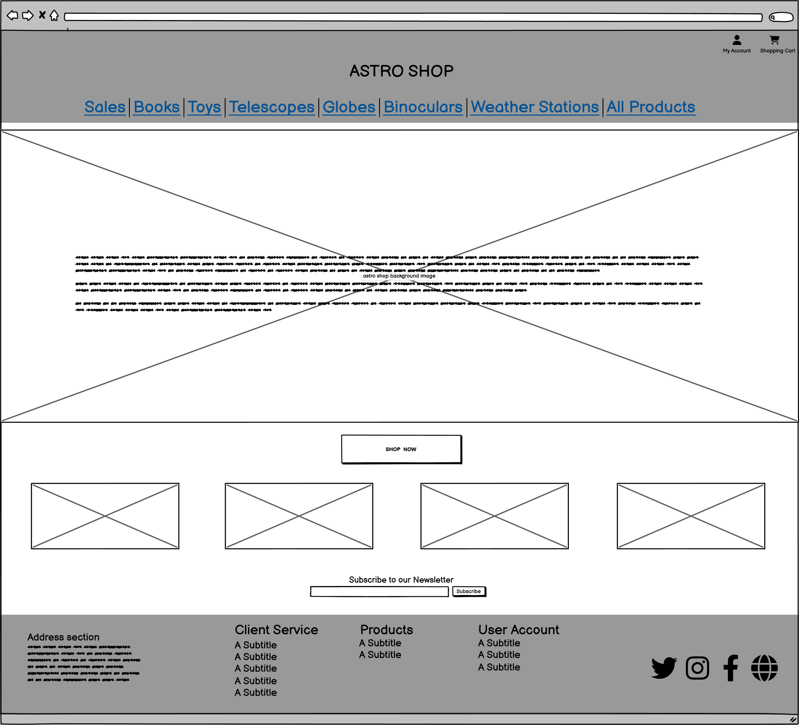

# Astro Shop

Explore the universe with AstroShop, the ultimate e-commerce destination for all your astronomical needs. From high-quality telescopes and astrophotography equipment to star charts and celestial decor, we have everything to fuel your passion for the stars. Whether you're an amateur stargazer or a seasoned astronomer, AstroShop brings the cosmos closer to home with premium products, expert advice, and a seamless shopping experience. 🌌✨

"Unlock the wonders of the universe—shop AstroShop today!"

A live version of the project can be accessed here: [AstroShop](https://https://astroshop-1fc783ba013f.herokuapp.com/)

# Table Of Contents
  - [Astro Shop](#astro-shop)
  - [Development Tools](#development-tools)
  - [CSS Management for Project Structure](#css-management-for-project-structure)
    - [Index Page Overview](#index-page-overview)
    - [Front Page Overview](#front-page-overview)
    - [Mobile first design](#mobile-first-design)
  - [Colors](#colors)
    - [Color Customization Process](#color-customization-process)  
  - [Fonts](#fonts)
  - [Icons](#icons)      
  - [Technologies Used](#technologies-used)
    - [Wireframes](#wireframes)
      - [Wireframes for Homepage & Frontpage](#wireframes-for-homepage--frontpage)
    - [Favicon](#favicon)
    - [Languages](#languages)
    - [Frameworks & Software](#frameworks--software)
    - [Libraries and modules](#libraries-and-modules)
    - [AWS](#aws)
    - [Newsletter Gmail API](#newsletter-gmail-api)
    - [The Structure Plane - Site maps](#the-structure-plane---site-maps)
    - [The Structure Plane - Database](#the-structure-plane---database)
      - [Database](#database)
  - [UX & Agile](#ux--agile)

  - [Facebook](#facebook)

  - [Testing](#testing)
    - [HTML Validation](#html-validation)
    - [CSS Validation](#css-validation)
    - [Accessibility](#accessibility)
    - [Wave Validation](#wave-validation) 
    - [Lighthouse Validation](#lighthouse-validation)
    - [JSHint Validation](#jshint-validation)
    - [Device Testing](#device-testing)
    - [Browser Compatibility](#browser-compatibility)
    - [PEP8](#pep8)
    - [Device Test](#device-testing)
    - [User Stories Testing](#user-story-testing)
  - [Deployment](#deployment)
    - [Heroku Deployment](#heroku-deployment)
    - [AWS](#aws)
    - [Local deployment](#local-deployment)
    - [Forking this GitHub repository](#forking-this-github-repository)
    - [Clone this repository](#clone-this-repository)
    - [Cloudinary](#cloudinary)
    - [Create PostgreSQL using Code Institute Database](#create-a-new-postgresql-code-institute-database)
    - [Gmail](#gmail)
  - [Bugs & Fixes](#bugs--fixes)
  - [License](#license)
  - [Credits](#credits)

## Development Tools

- **Bootstrap:** Bootstrap is a popular front-end development framework that helps developers create responsive, mobile-first websites quickly and efficiently. It provides a collection of pre-designed HTML, CSS, and JavaScript components like buttons, forms, navigation bars, and grid layouts. By using Bootstrap, developers can build modern, visually consistent web pages without writing extensive custom code. It's widely appreciated for its ease of use, customization options, and ability to adapt to various screen sizes, making it a go-to tool for fast web development.
- **Modular Design:** Modular design is a system design approach that divides a system into independent, interchangeable modules. Each module performs a specific function, enabling flexibility, easy maintenance, scalability, and reusability.
- **Consistent Aesthetic:** To maintaining a unified and cohesive visual style across all elements of a design. This includes consistent use of colors, fonts, shapes, and layout, ensuring that all components appear harmonious. It enhances user experience by creating familiarity and brand identity, making designs more professional and visually appealing.

[Table Of Contents](#table-of-contents)

## CSS Management for Project Structure

In my project, I decided to use a single CSS file, styles.css, to manage all the styling across the application.
These variables are defined within styles.css, and ensuring they work correctly is crucial for applying themes consistently across the site.

By consolidating all the styles into one file, I make managing themes straightforward. If I need to switch themes or make adjustments, I only need to modify this single CSS file, which allows for a seamless transition to a new look and feel across the entire application. This approach not only simplifies maintenance but also reinforces my focus on code reuse and consistency.

Additionally, having a single CSS file helps me avoid complications related to injecting styles through Bootstrap, ensuring that the CSS variables function as intended throughout the application.

### Index Page Overview

The homepage starts with a 'hero section' featuring an embedded video stream in replay, along with a parallax effect designed to captivate visitors. This section offers users the option to engage with the Blog Post.

Following this, the AstroBlog section provides a brief introduction to the purpose of the site, helping visitors quickly understand what the site is about.

To build more interest, I have incorporated an 'Astronomy Picture of the Day' (APOD) section where users and visitors always have a new astronomical item to explore, providing an easy and quick overview of the latest posts.

In a zigzag pattern, the most popular categories are displayed on the homepage. To encourage further engagement with the blog, a 'Latest Contributors' section is also included.

For astronomical enthusiasts, a nice widget is incorporated that tracks the current position of the International Space Station (ISS). When clicking on the 'Go To the ISS' button, a new page appears with an independently generated world map showing the ISS’s location.

At the bottom of the page, I have included a subscription section where users can join the mailing list to receive newsletters, information, and relevant benefits.

Finally, the page concludes with a footer that reinforces credibility and includes essential links, such as the social media links for the blog.

### Front Page Overview
The **Front Page** is designed to give a quick overview of a list of 5 blog posts ranked by the date added, with the most recent post at the top of the page.

1. **NavBar**: The 'navbar' has a dual function and can be used by both visitors and authenticated users.
   - **For Visitors & Users**: can quickly navigate back to the "homepage" by clicking the home icon or to the 'front page blog posts' by clicking the left arrow icon.
   - **For Visitors**: Visitors can always read posts but cannot participate. They have the option to view posts by category or to join Astro Share Blog by registering.
   - **For Users**: Users have full CRUD (Create, Read, Update, Delete) functionality for their own posts. The 'Add Post' option appears, and they see 'Logged in as,' giving them the ability to change their profile settings and details.

2. **Blog Post Snippets**: Each blog post is presented as a snippet along with a corresponding image.
   - **For Visitors**: The `[read more]` link redirects to the article detail page where the full post can be read.
   - **For Users**: Users have the same functionality as visitors, but on the redirected page, they have full control over their posts.

3. **Detailed Article Posts**: On this page, each post is treated individually.
   - **For Visitors**: Visitors can read the full blog post and any comments (if available). They cannot like or comment on posts. Visitors can click on the author's name to view the author’s profile page.
   - **For Users**: Users can read the post, comment, and 'Like' the posts. They can only 'Dislike' posts they have already liked.  
     The option to dislike posts outright is not part of the blog’s policy.

### Mobile first design
To ensure a seamless experience across devices, Bootstrap is used to make the Home- & Frontpage fully responsive. On mobile devices, the table features horizontal scrolling to prevent content compression, maintaining clarity and usability. Additionally, each table row highlights with a colour change on hover, making it easier for users to track their interactions as they navigate.

[Table Of Contents](#table-of-contents)

## Colors

The color palette for this project has been carefully selected to ensure a professional and clean aesthetic, aligning with the brand identity and enhancing user experience. Below is a breakdown of the primary colors used across the application:

As for colors I decided to use Color-Hunt. https://colorhunt.co

- **Primary Color:** `#222831` -  is a dark charcoal gray with subtle blue-green undertones, perfect for sleek and modern designs.
- 

- **Secondary Color:** `#393E46` - (also atrribute color) s a dark plum or eggplant shade with a mix of deep purple and gray tones, ideal for rich and moody designs.
- 

- **Primary Color Highlight:** `#222831` - is a vibrant teal with cool blue and green tones, evoking a fresh, modern, and energetic feel.
- 

- **Background Color:** `#EEEEEE` - is a very light gray, almost white, offering a clean, soft, and neutral appearance.
- 

- **Accent Color:** `#00ADB5` - is a vibrant teal with cool blue and green tones, evoking a fresh, modern, and energetic feel.

- 

- **Main Text Color:** `#FFFFFF` - Tis pure white, the brightest and most neutral color, representing simplicity, cleanliness, and clarity.
- 
- **Secondary Text Color:** `#000000` - (--main-text-color-invers) Is pure black, the darkest color, symbolizing elegance, power, and sophistication.
- 

- **Highlight Hover Color:** `#FFC400` -  is a bold, vibrant yellow-gold, exuding warmth, energy, and a sense of luxury.
- 

- **Dark Text Shadow:** `2px 2px 4px rgba(0, 0, 0, 0.5)` - A bolder text shadow used on white backgrounds, ensuring 
that text stands out clearly.
- 

### Color Customization Process

The colour customization process in this project was designed to offer flexibility and personalisation. I have implemented a series of **CSS Variables** to define various colour palettes.

Key elements of the colour customization process include:

- **Multiple Colour Palettes**: I have created several distinct colour palettes, each with its unique style—ranging from more traditional to modern and alternative designs. The default palette, known as the **root palette**, is the primary theme that all users see upon first visiting the site.

- **CSS Variables**: The different colour palettes are implemented using CSS Variables, which allows for dynamic and flexible styling of various elements across the site. This ensures a consistent and responsive design while providing a personalised experience for each user.

### Fonts

I used a combination of classic and modern fonts to diversify myself, I've integrated [Google Fonts](https://fonts.google.com/ "Google Fonts") to find a typeface that complements the website's aesthetic. For the main text, I've opted for [Lato](https://fonts.google.com/specimen/Lato?query=Lato/ "Lato") due to its classic appearance. Its make it easy to read long sentences.

### Icons

As for icons and officious reason [Bootstrap Icons](https://getbootstrap.com/docs/5.0/extend/icons/ "Bootstrap Icons").

[Table Of Contents](#table-of-contents)

## Technologies Used

### Wireframes

The wireframes for this project served as a crucial guide during the development process, essentially acting as a blueprint for the design and layout of the website. My focus was primarily on two key pages: the index (or homepage) and the frontpage blog post. Given the repetitive nature of the blog post, I decided that it was a better idea to separate the homepage and the frontpage. The homepage serves more as an introductory page, while the frontpage blog post is a more active working page for the blog posts.

I chose to highlight only two wireframes in this README as they are the most critical to the overall user experience. Other pages did not require such detailed wireframing and followed more standard, basic templates.

### Wireframes for Homepage & Frontpage

  
Wireframe for Homepage (index) - Desktop 

  

 

  
Wireframe for Product Page - Desktop

  

 

  
Wireframe for Tablet Homepage Responsive

  

 

  
Wireframe for Tablet Products Responsive
  
  

 

  
Wireframe for Smart Phone Homepage Responsive

  

 

  
Wireframe for Smart Phone Products Responsive
  
  

 

### Favicon

The favicon was created with [Favicon.io](https://favicon.io/favicon-generator/). 

  

### Languages
* [Python](https://en.wikipedia.org/wiki/Python_(programming_language)) - Provides the functionality for the site.
* [HTML5](https://en.wikipedia.org/wiki/HTML) - Provides the content and structure for the website.
* [CSS3](https://en.wikipedia.org/wiki/CSS) - Provides the styling for the website.
* [JavaScript](https://en.wikipedia.org/wiki/JavaScript) - Provides interactive elements of the website

### Frameworks & Software
* [Gitpod](http://gitpod.io) - Cloud based IDE
* [Bootstrap](https://getbootstrap.com/) - A CSS framework that helps building solid, responsive, mobile-first sites
  -  **Bootstrap:** Integrated to utilize its responsive grid system and pre-built components, ensuring the site is mobile-friendly and adaptable to different screen sizes.
* [Django](https://www.djangoproject.com/) - A model-view-template framework used to create the Review | Alliance site
* [Balsamiq](https://balsamiq.com/) - Used to create the wireframe.
* [Pexels](https://www.pexels.com/) - Used for background image and animation video.
* [Github](https://github.com/) - Used to host and edit the website.
* [Eraser](https://app.eraser.io/) - Used to created the Database layout schema.
* [Heroku](https://en.wikipedia.org/wiki/Heroku) - A cloud platform that the application is deployed to.
* [Lighthouse](https://developer.chrome.com/docs/lighthouse/overview/) - Used to test performance of site.
* [Responsive Design Checker](https://www.responsivedesignchecker.com/) - Used for responsiveness check.
* [Wave Web Accessibility Evaluation Tool](https://wave.webaim.org/) - Used to validate the sites accessibility.
* [Favicon](https://favicon.io/) - Used to create the favicon.
* [Google Chrome DevTools](https://developer.chrome.com/docs/devtools/) - Used to debug and test responsiveness.
* [ChatGPT](http://chatgpt.com) AI tool for troubleshooting and repetitive tasks.
* [HTML Validation](https://validator.w3.org/) - Used to validate HTML code
  -  **HTML:** The foundation for structuring the web pages, providing the semantic markup needed for the site's content.
* [CSS Validation](https://jigsaw.w3.org/css-validator/) - Used to validate CSS code
  -  **PostgreSQL:** The primary database used to store user data, blog post listings, article details, ... chosen for its flexibility and scalability.
* [PEP8 Validation](https://pep8ci.herokuapp.com/#) - Used to validate code 
* [JSHint Validation](https://jshint.com/) - Used to validate JavaScript code
  -  **JavaScript:** Employed to add interactivity and dynamic elements to the site, enhancing the user experience with features like form validation and asynchronous content updates.

[Table Of Contents](#table-of-contents)

### Libraries and modules

`asgiref==3.7.2`
ASGI (Asynchronous Server Gateway Interface) reference implementation. It provides utilities for building and maintaining asynchronous web applications in Python. This module is particularly useful for handling asynchronous protocols such as WebSockets and HTTP/2.

`boto3==1.35.45` is the AWS SDK for Python, enabling Python apps to manage and automate AWS resources like S3, EC2, and Lambda. It provides updated APIs for seamless integration with AWS services.

`botocore==1.35.45` is a core library for AWS SDK in Python, providing low-level access to AWS APIs. It underlies `boto3`, handling service requests, authentication, and responses for seamless AWS interactions.

`dj-database-url==0.5.0`
A utility for Django that allows database configuration from a URL string. This is particularly useful for deploying applications on platforms like Heroku, where database URLs are often provided in the environment variables.

`dj3-cloudinary-storage==0.0.6`
A storage backend for Django that integrates with Cloudinary. It allows developers to easily upload and manage media files in their Django applications using Cloudinary as the storage provider.

`django==4.2`
The latest version of the Django web framework, which is a high-level Python framework that encourages rapid development and clean, pragmatic design. Django is known for its scalability and its robust features like ORM, admin interface, authentication, and security features.

`django-paypal==2.1`
Is a Django app that integrates PayPal payment processing into Django projects. It supports both PayPal Payments Standard and PayPal Payments Pro, making it easy to add PayPal payment options to e-commerce sites built with Django.

`django-storages==1.14.4` 
Is a Django library providing integration with various cloud storage backends like Amazon S3, Google Cloud Storage, and Azure Storage. It simplifies managing static and media files in the cloud for Django applications, with customizable settings for each storage option.

`gunicorn==20.1.0`
A Python WSGI HTTP server for UNIX that serves web applications in a production environment. Gunicorn is lightweight and designed to handle many concurrent requests, making it a popular choice for deploying Django applications.

`jmespath==1.0.1` 
Is a Python library for JSON data querying. It enables searching, filtering, and extracting specific data from JSON documents using JMESPath syntax, which is useful for handling and manipulating JSON responses, especially in applications interacting with APIs.

`pillow==10.4.0` 
Is a Python Imaging Library (PIL) fork that adds image processing capabilities, including opening, manipulating, and saving many image formats like JPEG, PNG, and GIF. It’s commonly used in web development for tasks like resizing, cropping, and enhancing images.

`psycopg2==2.9.6` 
The most popular PostgreSQL database adapter for Python. Psycopg2 enables Python applications to connect to and interact with PostgreSQL databases, supporting advanced features like connection pooling and asynchronous operations.

`pycryptodome==3.21.0` 
Is a Python library offering cryptographic functions, including encryption, decryption, hashing, and digital signatures. It supports algorithms like AES, RSA, and SHA, making it useful for securing data in applications requiring cryptography.

`pytz==2024.2` 
Is a Python library providing accurate and up-to-date timezone definitions, essential for managing timezone conversions and handling daylight saving time changes in applications. It allows developers to work with timezone-aware `datetime` objects.

`s3transfer==0.10.3` 
Is a Python library that provides a high-level interface for transferring files to and from Amazon S3. It supports multipart uploads, automatic retries, and parallel transfers, enhancing the efficiency and reliability of file handling in applications that interact with S3.

`sqlparse==0.5.1` 
Is a non-validating SQL parser for Python. It provides tools for parsing, formatting, and analyzing SQL statements, making it useful for applications that require SQL code manipulation or analysis, such as ORM libraries or database administration tools.

`whitenoise==5.3.0`
A middleware for serving static files in a Django application. Whitenoise allows applications to serve static assets directly without needing a separate web server, simplifying deployment and reducing complexity.

## AWS

In this project, I use **AWS S3 Object Storage** services to store product images directly in AWS.  
You can create a free account for development purposes to integrate it into your project.

**AWS S3** (Amazon Simple Storage Service) is a scalable, secure, and high-performance cloud storage solution provided by Amazon Web Services. It is designed for object storage, allowing users to store and retrieve data of any size and type, such as images, videos, documents, or backups. 

## Key Features

- **Scalability**: Automatically scales to handle increasing or decreasing storage needs.  
- **Durability and Availability**: Offers 99.9% durability and high availability across multiple geographic regions.  
- **Cost-Effective**: Flexible pricing with options like S3 Standard for frequently accessed data, S3 Glacier for archival storage, and S3 Intelligent-Tiering for automated cost optimization.  
- **Security**: Provides encryption, access control, and compliance features to protect data.  
- **Integration**: Works seamlessly with other AWS services and supports APIs for custom integrations.  

S3 is widely used for website hosting, data backups, content delivery, and big data analytics.

### How to Set It Up?

The setup can be quite comprehensive, so here is a guide to help you through it:  
[Google Docs Guide](https://docs.google.com/document/d/1bqvCFiCW_JV9sllNZrN5uUJpIiusHICTk4TIk3oUWHY/edit?tab=t.0#heading=h.jypp4mbtvx4q)

## Newsletter Gmail API

A newsletter subscription integration for example Facebook marketing allows businesses to reach their audience directly through Facebook's platform. By leveraging the newsletter, developers can create seamless subscription options, enabling users to sign up for newsletters while engaging with your brand on Facebook. This integration can streamline the process of collecting subscriber information, automating newsletter delivery, and managing subscriber data.

With the newsletter subscription API, the business can target their audience more effectively, ensuring newsletters are personalized and relevant to users' interests. Additionally, this integration helps track engagement metrics and optimize marketing efforts for better outreach and conversions.

- More information how to integrate the Gmail API can be found [here](https://developers.google.com/gmail/api/guides)

### Mobile first design
To ensure a seamless experience across devices, Bootstrap is used to make the Home- & Frontpage fully responsive. On mobile devices, the table features horizontal scrolling to prevent content compression, maintaining clarity and usability. Additionally, each table row highlights with a colour change on hover, making it easier for users to track their interactions as they navigate.

## Bootstrap themes

I choose to make life easier to use a free bootstap template from https://startbootstrap.com/template/shop-homepage
this theme i espiaclly designed for Ecommerce apllications.

It delivers the template file you can customize afterwords whit default ccs, js ,index page en asset folder for favicon.

It's recommend to use a front-end bootstrap template, so that easier to start the project and dive in to core application of Django.

## Deployment

### Heroku Deployment
This site was deployed to and is currently [hosted on the Heroku platform](https://astroshare-blog-6a7ca9d34749.herokuapp.com/). The steps for deploying to Heroku, using PostgreSQL as the database host, are as follows:

1. Create a list of requirements in the requirements.txt file by using the command pip3 freeze > requirements.txt
2. Log in (or sign up) to Heroku
3. Click on the New button and select *Create new app*
4. Give it a unique name and choose the region *Europe*
5. Click the Settings tab, go to the *Config Vars* section and click on the Reveal Config Vars button
6. Add all variables from *env.py* to ConfigVars of Heroku

 
  
Click to view details Config Vars Heroku

  
   

 
7. Click the *Add* button
8. Click the *Deploy* tab, go to the *Deployment method section*, select *GitHub* and confirm this selection by clicking on the *Connect to Github* button
9. Search for the repository name on github *Astro Blog* and click the *Connect* button
10. Add in the *setting.py* the Heroku app URL into ALLOWED HOSTS
11. Gather all static files of the project by using the command *python3 manage.py collectstatic* in the terminal
12. Make sure that DEBUG=FALSE in *settings.py*
13. Create a *Procfile* in the root directory and add *web: gunicorn astroshare-blog.wsgi*
14. In Heroku enable the automatic deploy or manually deploy the code from the main branch

### Local Deployment
1. Generate an *env.py* file in the root directory of the project
2. Configure the environment variables within this file
3. Create a virtual environment
4. Install all required dependencies using pip install command into the .venv
5. Add dependencies to the requirements.txt file using pip3 freeze > requirements.txt command

### Forking this GitHub repository
1. Log in to GitHub.
2. Navigate to the repository for this project by selecting [*Harmonica-Men/AstroShare-Blog*](https://github.com/Harmonica-Men/AstroShare-Blog)
3. Click at the top of the repository on the Fork button on the right side

### Clone this repository
1. Log in to GitHub.
2. Navigate to the repository for this project by selecting [*Harmonica-Men/AstroShare-Blog*](https://github.com/Harmonica-Men/AstroShare-Blog)
3. In the top-right corner, click on the green *Code* button
4. Copy the HTTPS URL in the tab *Local*
5. Go to the code editor of your choice and open the terminal
5. Type `git clone` and paste the URL you copied into your terminal
6. Press the enter key

### Cloudinary
1. Navigate to [Cloudinary](https://cloudinary.com/)
2. Sign up or log in to account
3. Go to the dashboard
4. Click on _Go to API Keys_ button
5. Generate a new API Key
6. Provide the API environment variable in format: *CLOUDINARY_URL=cloudinary://<your_api_key>:<your_api_secret>@ds5rjhhxu* in _env.py_ and _Config Vars_
7. Update *settings.py*

#### Create a new PostgreSQL Code Institute database.

From codeinstitute every student can maintain up to eight databases to run there projects. Here is a step by step guide to install PostgreSQL from Code Institute to the cloud!

  1. Navigate to [PostgreSQL from Code Institute](https://dbs.ci-dbs.net/) and input with your LMS account
     - *The link works only if you are a student of Code Institute*
       
      

        
       
PostgreSQL database creation step1

       
        
      

       

  2. After you filled in your LMS account the PostgresSQL database manager will automatically generate a new database for you.
       
      

        
       
PostgreSQL database creation step2

       
        
      

       

  3. You now have a brand new PostgreSQL Code Institute database
  The link to this database and how to manage all your other databases will be sent to my email. 
       
      

        
       
PostgreSQL database creation step3

       
        
      

       

  4. **Note:** These databases are limited in time and have a life time of operation of 18 months after the date of creation.
       
      

        
       
PostgreSQL database creation step4

       
        
      

       

### Gmail

1. Navigate to [Gmail](https://www.google.com/intl/de/gmail/about/)
2. Sign up or log in to account
3. Go to the settings and enable 2-step verification and IMAP
4. Navigate to your [Google account](https://myaccount.google.com/) 
5. Search in search bar for _App password_
6. Create new app password and copy this as variable in _env.py_ and _Config Vars_
7. Update settings.py
  
[Table Of Contents](#table-of-contents)

## Bugs & Fixes

- In order to properly work with the NASA APOD API, I was unable to hide the API KEY from *views.py* (line 266) and the JavaScript (line 6). After extensive debugging, I was forced to hardcode the API KEY into the code.
- The issues I struggled with were how to enforce the JavaScript onto a JSON response fetch, which was too complicated.
- After that, I also had problems recalling the `NASA_API_KEY` from *settings.py*.
- For demonstrational purposes, I hardcoded the API KEYS to show the potential of the APIs.
- Further more in the newsletter subscription there should be a confirmation message displayed but was included but fail to render. Instead a 404 page was returned.

## License

Astro Share Blog is licensed under the Creative Commons Attribution-NonCommercial-ShareAlike 4.0 International License.

You are free to:

- **Share:** Copy and redistribute the material in any medium or format.

- **Adapt:** Remix, transform, and build upon the material.

Under the following terms:

- **Attribution:** You must give appropriate credit, provide a link to the license, and indicate if changes were made. You may do so in any reasonable manner, but not in any way that suggests the licensor endorses you or your use.

- **NonCommercial:** You may not use the material for commercial purposes.

- **ShareAlike:** If you remix, transform, or build upon the material, you must distribute your contributions under the same license as the original.

For more information about the Creative Commons Attribution-NonCommercial-ShareAlike 4.0 International License, visit [here](https://creativecommons.org/licenses/by-nc-sa/4.0/).

## Credits

- I would like to express my deepest gratitude to my excellent mentor Student Mentor, Daisy Mcgirr for her numerous tips and wonderful assistance during the creation of this project.
- Furthermore, I would like to thank Lino Bollansee. I greatly appreciate his frequent comments during the creation of my project.

**This is for educational use**

[Table Of Contents](#table-of-contents)

## User Story Testing

Manual Testing Result Report

 

| Scenario                                                        | Action                                                     | Result                                                                                    | Check |
| --------------------------------------------------------------- | ---------------------------------------------------------- | ----------------------------------------------------------------------------------------- | ----- |
| Click the “SHOP NOW” Button                                     | Should navigate to Products page                           | Redirect to “Product” page                                                                | PASS  |
| Fill in “Subscribe to our Newsletterâ€Fill in Email after Submit | Should navigate to Check Email Page                     | Redirect to “Check your Email†page                                                    | PASS  |
| Homepage – Header                                               |                                                            |                                                                                           |       |
| Click “Sales”                                                   | Should navigate to “Category/Sales”                        | Redirect to “category/Sales” page                                                         | PASS  |
| Click “Books”                                                   | Should navigate to “Category/Books”                        | Redirect to “category/books” page                                                         | PASS  |
| Clcik “Telescopes”                                              | Should navigate to “Category/Toys”                         | Redirect to “category/toys” page                                                          | PASS  |
| Clcik “Globes”                                                  | Should navigate to “Category/Globes”                       | Redirect to “category/globes” page                                                        | PASS  |
| Click “Binoculars”                                              | Should navigate to “Category/Binoculars”                   | Redirect to “category/binoculars” page                                                    | PASS  |
| Clcik “Weather Station”                                         | Should navigate to “Category/Weather Station”              | Redirect to “category/weather stations” page                                              | PASS  |
| Clcik “All Products”                                            | Should navigate to “Category/All Products”                 | Redirect to “category/all Products” page                                                  | PASS  |
| Click “My Account”                                              | Should navigate to Account Menu as Super User              | Show Menu                                                                                 |       |
| Click “My Account” – My Profile                                 | Should navigate to ‘Update User Profile”                   | Redirect to “Update User Profile” – page                                                  | Pass  |
| Click “My Account” – My Update Shipping                         | Should navigate to ‘Update Ship Profle”                    | Redirect to “Update Ship Profile” – page                                                  |       |
| Click “My Account” – My Payment                                 | Should navigate to ‘Update Payment Profle”                 | Redirect to “Update Payment Profile” – page                                               | PASS  |
| Click “My Account” – User Account                               | Should navigate to ‘User Account”                          | Redirect to “User Account” Settings                                                       | PASS  |
| Click “My Account” – Change Password                            | Should navigate to “Update Password”                       | Redirect to “Update Password” Page                                                        | PASS  |
| Click “My Account” – Log Out                                    | Should navigate to “Home Page”                             | Redirect to “Home Page” whit Message “You have logged out”                                |       |
| Click “My Account” – Add new product                            | Should navigate to “Add New Product”                       | Redirect to “Add a New Product”                                                           | PASS  |
| Click “My Account” – Supplier List                              | Should navigate to “Supplier List”                         | Redirect to “Suppliers” Page                                                              | PASS  |
| Click “My Account” – View Orders                                | Should navigate to “payment Orders ”                       | Redirect to “Payment Orders” Page                                                         | PASS  |
| Click ”My Account” – Shipped Orders                             | Should navigate to “Shipping Dashboard”                    | Redirect to “Shipped Dash” Page                                                           | PASS  |
| Click ”My Account” – Unshipped Orders                           | Should navigate to “Unshipping Dashboard”                  | Redirect to “Unshipped Dash” Page                                                         | PASS  |
| Click “My Account”                                              | Should navigate to Account Menu as Regular User            | Show Menu                                                                                 |       |
| Click “My Account” – My Profile                                 | Should navigate to ‘Update User Profile”                   | Redirect to “Update User Profile” – page                                                  | PASS  |
| Click “My Account” – My Update Shipping                         | Should navigate to ‘Update Ship Profle”                    | Redirect to “Update Ship Profile” – page                                                  | PASS  |
| Click “My Account” – My Payment                                 | Should navigate to ‘Update Payment Profle”                 | Redirect to “Update Payment Profile” – page                                               | PASS  |
| Click “My Account” – My Orders                                  | Should navigate to “payment Orders ”                       | Redirect to “Payment Orders” Page                                                         | PASS  |
| Click “My Account” – User Account                               | Should navigate to ‘User Account”                          | Redirect to “User Account” Settings                                                       | PASS  |
| Click “My Account” – Change Password                            | Should navigate to “Update Password”                       | Redirect to “Update Password” Page                                                        | PASS  |
| Click “My Account” – Log Out                                    | Should navigate to “Home Page”                             | Redirect to “Home Page” whit Message “You have logged out”                                | PASS  |
| Click “Shop Cart Items”                                         | Should navigate to “Shopping Cart”                         | Redirect to “ShopCart” Page                                                               | PASS  |
| Homepage – footer section                                       |                                                            |                                                                                           |       |
| Click “About”                                                   | Should navigate to “About”                                 | Redirect to “About” Page                                                                  | PASS  |
| Click “General Condintions”                                     | Should navigate to “General Conditions”                    | Redirect to “General Conditions ” Page                                                    | PASS  |
| Click “Privacy Policy”                                          | Should navigate to “Privacy Policy”                        | Redirect to “Privacy Policy” Page                                                         | PASS  |
| Click “Disclaimer”                                              | Should navigate to “Disclaimer”                            | Redirect to “Disclaimer” Page                                                             | PASS  |
| Click “Payment”                                                 | Should navigate to “Payment”                               | Redirect to “Payment” Page                                                                | PASS  |
| Homepage – socails section                                      |                                                            |                                                                                           |       |
| clcik “twitter”                                                 | Should navigate to “Twitter”                               | Redirect to “[https://x.com/?lang=en](https://x.com/?lang=en)” Page                       | PASS  |
| clcik “Instagram”                                               | Should navigate to “Instagram”                             | Redirect to “[https://www.instagram.com/](https://www.instagram.com/)” Page               | PASS  |
| clcik “facebook”                                                | Should navigate to “Facebook”                              | Redirect to “[https://www.facebook.com/](https://www.facebook.com/)” Page                 | PASS  |
| click “Globe”                                                   | Should navigate to “CodeInstitute”                         | Redirect to “[https://codeinstitute.net/global/](https://codeinstitute.net/global/)” Page | PASS  |
|                                                                 |                                                            |                                                                                           |       |
| Products Page – Template                                        |                                                            |                                                                                           |       |
| Click “Astro Shop” Button                                       | Should navigate to “Home Page”                             | Redirect to “Homepage”                                                                    | PASS  |
| Click “Product”                                                 | Should navigate to product                                 | Redirect to “product” page (product detail page)                                          | PASS  |
|                                                                 |                                                            |                                                                                           |       |
| Navbar Buttons                                                  |                                                            |                                                                                           |       |
| Click “About” Button                                            | Should navigate to “About”                                 | Redirect to “About” Page                                                                  | PASS  |
| Click “Search” Button                                           | Should navigate to “Search”                                | Redirect to “Search” Page                                                                 | PASS  |
| Click “My Account”                                              | Should navigate to Account Menu as Super User              | Show Menu                                                                                 | PASS  |
| Click “My Account” – My Profile                                 | Should navigate to ‘Update User Profile”                   | Redirect to “Update User Profile” – page                                                  | PASS  |
| Click “My Account” – My Update Shipping                         | Should navigate to ‘Update Ship Profle”                    | Redirect to “Update Ship Profile” – page                                                  | PASS  |
| Click “My Account” – My Payment                                 | Should navigate to ‘Update Payment Profle”                 | Redirect to “Update Payment Profile” – page                                               | PASS  |
| Click “My Account” – User Account                               | Should navigate to ‘User Account”                          | Redirect to “User Account” Settings                                                       | PASS  |
| Click “My Account” – Change Password                            | Should navigate to “Update Password”                       | Redirect to “Update Password” Page                                                        | PASS  |
| Click “My Account” – Log Out                                    | Should navigate to “Home Page”                             | Redirect to “Home Page” whit Message “You have logged out”                                | PASS  |
| Click “My Account” – Add new product                            | Should navigate to “Add New Product”                       | Redirect to “Add a New Product”                                                           | PASS  |
| Click “My Account” – Supplier List                              | Should navigate to “Supplier List”                         | Redirect to “Suppliers” Page                                                              | PASS  |
| Click “My Account” – View Orders                                | Should navigate to “payment Orders ”                       | Redirect to “Payment Orders” Page                                                         | PASS  |
| Click ”My Account” – Shipped Orders                             | Should navigate to “Shipping Dashboard”                    | Redirect to “Shipped Dash” Page                                                           | PASS  |
| Click ”My Account” – Unshipped Orders                           | Should navigate to “Unshipping Dashboard”                  | Redirect to “Unshipped Dash” Page                                                         | PASS  |
| Click “My Account”                                              | Should navigate to Account Menu as Regular User            | Show Menu                                                                                 | PASS  |
| Click “My Account” – My Profile                                 | Should navigate to ‘Update User Profile”                   | Redirect to “Update User Profile” – page                                                  | PASS  |
| Click “My Account” – My Update Shipping                         | Should navigate to ‘Update Ship Profle”                    | Redirect to “Update Ship Profile” – page                                                  | PASS  |
| Click “My Account” – My Payment                                 | Should navigate to ‘Update Payment Profle”                 | Redirect to “Update Payment Profile” – page                                               | PASS  |
| Click “My Account” – My Orders                                  | Should navigate to “payment Orders ”                       | Redirect to “Payment Orders” Page                                                         | PASS  |
| Click “My Account” – User Account                               | Should navigate to ‘User Account”                          | Redirect to “User Account” Settings                                                       | PASS  |
| Click “My Account” – Change Password                            | Should navigate to “Update Password”                       | Redirect to “Update Password” Page                                                        | PASS  |
| Click “My Account” – Log Out                                    | Should navigate to “Home Page”                             | Redirect to “Home Page” whit Message “You have logged out”                                | PASS  |
| Click “Shop Cart Items”                                         | Should navigate to “Shopping Cart”                         | Redirect to “ShopCart” Page                                                               | PASS  |
| Click All Products                                              | Should navigate to All Products Menu                       | Show Menu                                                                                 | PASS  |
| Click “By Price”                                                | Should navigate to Products page sort by price             | Redirect to Products page sort by price (ascending)                                       | PASS  |
| Click “By Category”                                             | Should navigate to Products page sort by category          | Redirect to Products page sort by category (category)                                     | PASS  |
| Click “All Products”                                            | Should navigate to Products page                           | Redirect to Products page                                                                 | PASS  |
| Click Product Category                                          | Should navigate to Product Category menu                   | Show Menu                                                                                 | PASS  |
| Click “Sale”                                                    | Should navigate to “Sale” category                         | Redirect to “Sale” page                                                                   | PASS  |
| Click “Books”                                                   | Should navigate to “Books” category                        | Redirect to “Books” page (product page by Books)                                          | PASS  |
| Click “Toys”                                                    | Should navigate to “Toys” category                         | Redirect to “Toys” page (product page by Toys)                                            | PASS  |
| Click “Telescopes”                                              | Should navigate to “Telescopes” category                   | Redirect to “Telescopes” page (product page by Telescopes)                                | PASS  |
| Click “Globes”                                                  | Should navigate to “Globes” category                       | Redirect to “Globes” page (product page by Globes)                                        | PASS  |
| Click “Specials”                                                | Should navigate to “Specials” category                     | Redirect to “Specials” page (product page by Specails)                                    | PASS  |
| Click “Weather Stations”                                        | Should navigate to “Weather Stations” category             | Redirect to “Weather Stations” page (product page by Weather Stations)                    | PASS  |
| Click “All Products”                                            | Should navigate to products                                | Redirect to “Products” page                                                               | PASS  |
|                                                                 |                                                            |                                                                                           |       |
| Click “Product”                                                 | Should navigate to product                                 | Redirect to “product” page (product detail page)                                          | PASS  |
|                                                                 |                                                            |                                                                                           |       |
| Product Details Page – logged in as regular user                |                                                            |                                                                                           |       |
| Navbar Buttons                                                  | see above – tests navbar – (regular user)                  | see above – tests navbar – (regular user)                                                 | PASS  |
| Click “Add to Chart” button                                     | Should navigate to “Product” + toast message succes        | Stay on the Product page                                                                  | PASS  |
| click “Category” item                                           | Should navigate to Category                                | Redirect to Products page sort by category (category)                                     | PASS  |
| Click “Quantity” selector                                       | Should select to quantity                                  | Set the amount of quantity                                                                | PASS  |
| Click “Delete Item” Button                                      | Should delete Item                                         | Toast Message “Item deleted from Shopping Cart”                                           | PASS  |
| Click “Edit Product”                                            | Should navigate to “Product update” page                   | Redirect to Products Update page                                                          | PASS  |
| Click “Back To Products”                                        | Should navigate to “Products” page                         | Redirect to Products page                                                                 | PASS  |
| Click “Checkout”                                                | Should navigate to “Check Out” page                        | Redirect to Check out page                                                                | PASS  |
|                                                                 |                                                            |                                                                                           |       |
| Shopcart Page (summary) – logged in as superuser                |                                                            |                                                                                           |       |
| Navbar Buttons                                                  | see above – tests navbar                                   | see above – tests navbar                                                                  | PASS  |
| Click “Add to Chart” button                                     | Should navigate to “Product” + toast message succes        | Stay on the Product page                                                                  | PASS  |
| click “Category” item                                           | Should navigate to Category                                | Redirect to Products page sort by category (category)                                     | PASS  |
| Click “Quantity” selector                                       | Should select to quantity                                  | Set the amount of quantity                                                                | PASS  |
| Click “Delete Product”                                          | Should navigate to “Delete Product Confirmation”           | Redirect to Delete Product Confirm page                                                   | PASS  |
| Click “Edit Product”                                            | Should navigate to “Product update” page                   | Redirect to Products Update page                                                          | PASS  |
| Click “Back To Products”                                        | Should navigate to “Products” page                         | Redirect to Products page                                                                 | PASS  |
| Click “Checkout”                                                | Should navigate to “Check Out” page                        | Redirect to Check out page                                                                | PASS  |
|                                                                 |                                                            |                                                                                           |       |
| Checkout Page                                                   |                                                            |                                                                                           |       |
| Navbar Buttons                                                  | see above – tests navbar                                   | see above – tests navbar                                                                  | PASS  |
| Click “Update Chart”                                            | Should navigate to “Shopcart” Page                         | Redirect to “ShopCart” Page                                                               | PASS  |
| Click “Make Order”                                              | Should navigate to “Billing Info” Page                     | Redirect to “Billing Info” Page                                                           | PASS  |
| Click “PayPal” Button                                           | Should navigate to “PayPal.com” Page                       | Redirect to “PayPal.com” Page                                                             | PASS  |
|                                                                 |                                                            |                                                                                           |       |
| Search Page                                                     |                                                            |                                                                                           |       |
| Navbar Buttons                                                  | see above – tests navbar                                   | see above – tests navbar                                                                  | PASS  |
| Click “Search”                                                  | Should navigate to “Search”Page (product found)            | Redirect to “Search” Page (listed products found)                                         | PASS  |
|                                                                 |                                                            |                                                                                           |       |
| Update User Profile – template                                  |                                                            |                                                                                           |       |
| Click “Back To Products”                                        | Should navigate to “Products” page                         | Redirect to “Products” page                                                               | PASS  |
| Click “Update Profile”                                          | Should navigate to “Products” page                         | Redirect to “Products” page                                                               | PASS  |
|                                                                 |                                                            |                                                                                           |       |
| Update Ship Profile – template                                  |                                                            |                                                                                           |       |
| Click “Back To Products”                                        | Should navigate to “Products” page                         | Redirect to “Products” page                                                               | PASS  |
| Click “Update Profile”                                          | Should navigate to “Products” page                         | Redirect to “Products” page                                                               | PASS  |
|                                                                 |                                                            |                                                                                           |       |
| Update User – template                                          |                                                            |                                                                                           |       |
| Click “Back To Products”                                        | Should navigate to “Products” page                         | Redirect to “Products” page                                                               | PASS  |
| Click “Update Profile”                                          | Should navigate to “Products” page                         | Redirect to “Products” page                                                               | PASS  |
|                                                                 |                                                            |                                                                                           |       |
| Update Password – template                                      |                                                            |                                                                                           |       |
| Click “Back To Products”                                        | Should navigate to “Products” page                         | Redirect to “Products” page                                                               | PASS  |
| Click “Update Password”                                         | Should navigate to “Products” page                         | Redirect to “Products” page                                                               | PASS  |
|                                                                 |                                                            |                                                                                           |       |
| Add New Product – template – as superuser                       |                                                            |                                                                                           |       |
| Click “Add Product”                                             | Should navigate to “Products” page                         | Redirect to “Products” page                                                               | PASS  |
| Click “Cancel”                                                  | Should navigate to “Products” page                         | Redirect to “Products” page                                                               | PASS  |
|                                                                 |                                                            |                                                                                           |       |
| Suppliers – template – as superuser                             |                                                            |                                                                                           |       |
| click “Add Supplier”                                            | Should navigate to “Supplier Add”page                      | Redirect to “Supllier Add” Page                                                           | PASS  |
| Click Nav link “Supplier”                                       | Should navigate to “Supplier” index page                   | Redirect to “Suppliers” index page                                                        | PASS  |
|                                                                 |                                                            |                                                                                           |       |
| View Orders – template – as superuser                           |                                                            |                                                                                           |       |
| Click “Mark as Shipped”                                         | Should navigate to “Mark Shipped”                          | Redirect to “Shipped” Page                                                                | PASS  |
| Click “Back To Products”                                        | Should navigate to “Products” page                         | Redirect to “Products” page                                                               | PASS  |
| Click “Shipped Orders”                                          | Should navigate to “Shipping Dashboard”                    | Redirect to “Shipped Dash” Page                                                           | PASS  |
| Click “Delete Order”                                            | Should navigate to “Delete Order”                          | Redirect to “Orders” Page                                                                 | PASS  |
|                                                                 |                                                            |                                                                                           |       |
| Shipped Items – template – as super user                        |                                                            |                                                                                           |       |
| Click nav link “Order”                                          | Should navigate to “Order” index page                      | Redirect to “Order” index page                                                            | PASS  |
| Click “Mark UnShipped”                                          | Should navigate to “Mark Unshipped”                        | Redirect to “Unshipped Dash” Page                                                         | PASS  |
| Click “Back To Products”                                        | Should navigate to “Products” page                         | Redirect to “Products” page                                                               | PASS  |
| Click “Unshipped Orders”                                        | Should navigate to “Unshipping Dashboard”                  | Redirect to “Unshipped Dash” Page                                                         | PASS  |
|                                                                 |                                                            |                                                                                           |       |
| UnShipped Items – template – as super user                      |                                                            |                                                                                           |       |
| Click nav link “Order”                                          | Should navigate to “Order” index page                      | Redirect to “Order” index page                                                            | PASS  |
| Click “Mark Shipped”                                            | Should navigate to “Mark Shipped”                          | Redirect to “Shipped” Page                                                                | PASS  |
| Click “Back To Products”                                        | Should navigate to “Products” page                         | Redirect to “Products” page                                                               | PASS  |
| Click “Shipped Orders”                                          | Should navigate to “Shipping Dashboard”                    | Redirect to “Shipped Dash” Page                                                           | PASS  |
|                                                                 |                                                            |                                                                                           |       |
| About – template                                                |                                                            |                                                                                           |       |
| Click “Back To Products”                                        | Should navigate to “Products” page                         | Redirect to “Products” page                                                               | PASS  |
|                                                                 |                                                            |                                                                                           |       |
| Disclaimer – template                                           |                                                            |                                                                                           |       |
| Click “Back To Products”                                        | Should navigate to “Products” page                         | Redirect to “Products” page                                                               | PASS  |
|                                                                 |                                                            |                                                                                           |       |
| General conditions – template                                   |                                                            |                                                                                           |       |
| Click “Back To Products”                                        | Should navigate to “Products” page                         | Redirect to “Products” page                                                               | PASS  |
|                                                                 |                                                            |                                                                                           |       |
| Privacy – template                                              |                                                            |                                                                                           |       |
| Click “Back To Products”                                        | Should navigate to “Products” page                         | Redirect to “Products” page                                                               | PASS  |
|                                                                 |                                                            |                                                                                           |       |
| Login – template                                                |                                                            |                                                                                           |       |
| Click “Login”                                                   | Should navigate to “Home” page                             | Redirect to “index” homepage                                                              | PASS  |
|                                                                 |                                                            |                                                                                           |       |
| Register – template                                             |                                                            |                                                                                           |       |
| Click “Register”                                                | Should navigate to “Update User And Shipping Profile” page | Redirect to “Update User And Shipping Profile” homepage                                   | PASS  |
|                                                                 |                                                            |                                                                                           |       |
| Update User And Shipping Profile – template                     |                                                            |                                                                                           |       |
| Click “Save Changes”                                            | Should navigate to “Products” page                         | Redirect to “Products” page                                                               | PASS  |

 

[Table Of Contents](#table-of-contents)

# FaceBook

